# Input {-}

Libraries used in various scripts and in the analysis on this report:

```{.r .fold-show}
library(gtools)
library(dplyr)
library(tibble)
library(tidyr)
library(readr)
library(stringr)
library(usefun)
library(foreach)
library(doParallel)
library(DT)
library(ggplot2)
library(ggpubr)
library(latex2exp)
library(BoolNet)
```

# Boolean Regulatory Functions {-}

**Boolean Regulatory Functions or BRFs** are boolean functions used in the context of biology networks and models.
A mathematical presentation of such a function with $n$ input variables (regulators) would be: $f_{BRF}:\{0,1\}^n \rightarrow \{0,1\}$, where the output of the target biological entity is always $0$ (FALSE/inactive/inhibited) or $1$ (TRUE/active).

## Link operator Boolean Regulatory Functions {-}

Let $f$ be a boolean function $f(x,y):\{0,1\}^n \rightarrow \{0,1\}$, with $m \ge 1$ **activators** $x=\{x_i\}_{i=1}^{m}$ and $k \ge 1$ **inhibitors** $y=\{y_j\}_{j=1}^{k}$, that is a total of $n = m + k$ regulators.
The link operator boolean functions have a (non-DNF) formula representation that partitions the two distinct type of regulators (positive regulators are called *activators*, negative regulators are called *inhibitors*) into two separate groups and connect them with a specific logical operator (which we call the *link operator*).
The presence of the link operator is what forces the condition $m,k \ge 1$ (at least one regulator in each category).
An example of such a function that has been used in the literature is the formula with the `AND-NOT` link operator [@Mendoza2006]:

- `AND-NOT`: $$f_{AND-NOT}(x,y) = \left(\bigvee_{i=1}^{m} x_i\right) \land \lnot \left(\bigvee_{j=1}^{k} y_j\right)$$

A **variation** of this one is the `OR-NOT` link operator function:

- `OR-NOT`: $$f_{OR-NOT}(x,y) = \left(\bigvee_{i=1}^{m} x_i\right) \lor \lnot \left(\bigvee_{j=1}^{k} y_j\right)$$

In theory, we could use any of the known logical operators as a link operator, e.g. `XOR`, `NAND`, etc.

For example, another link operator function is the next one ^[We call it *pairs* function since the intuition behind it is that the function returns *TRUE* if there is at least one pair of regulators consisting of a **present activator** and an **absent inhibitor**]:

:::{#pairs-fun}
:::
- `Pairs`: $$f_{pairs}(x,y) = \bigvee_{\forall (i,j)}^{m,k}(x_i\land \lnot y_j) = \left(\bigvee_{i=1}^{m} x_i\right) \land \left(\bigvee_{j=1}^{k} \lnot y_j\right)$$

:::{.note}
@Cury2019 defined the **consistent boolean regulatory** functions and their respective **complete DNF forms (CDNF)**.

The link operator functions listed above are a subset of these functions, since they respect the regulatory structure in their respective DNF forms (for the *Pairs* function it's evident since it's written first in the DNF - for the *AND-NOT* and *OR-NOT* functions, see their respective DNF forms in the truth density proofs \@ref(prp:and-not-proof) and \@ref(prp:or-not-proof).
:::

## Threshold functions {-}

The **boolean threshold functions** are formulated based on given *pseudo-Boolean* constrains for the regulators.
Thus, the activators and inhibitors are combined in an *additive* manner and not a *combinatorial* one and the **majority rule** defines the value of the function [@Chaouiya2013; @crama2011boolean].

Two simple cases of **threshold** functions are given below ^[Both threshold functions output *TRUE* when the number of present activators is larger than the number of present inhibitors. They differ when equal number of activators and inhibitors are present: in the first, the activators 'win' and thus the output is *TRUE*, whereas in the second the inhibitors *win* and the output is *FALSE*]:

- `Act-win`: $$f_{act-win}(x,y)=\begin{cases}
        1, & \text{for } \sum_{i=1}^{m} x_i \ge \sum_{j=1}^{k} y_j\\
        0, & \text{otherwise}
        \end{cases}$$
- `Inh-win`: $$f_{inh-win}(x,y)=\begin{cases}
        1, & \text{for } \sum_{i=1}^{m} x_i \gt \sum_{j=1}^{k} y_j\\
        0, & \text{otherwise}
        \end{cases}$$

Note that: $f_{inh-win}(x,y) = \lnot f_{act-win}(y,x)$.

:::{.blue-box}
Note that every boolean function has an equivalent combinatorial expression (i.e. the variables are connected with logical operators) and I searched for an analytic formula for the two last threshold functions.
More more info, see this [math.stackexchange question](https://math.stackexchange.com/questions/3767774/identify-boolean-function-that-satisfies-some-constrains/).
:::

# Truth Density Data Analysis {-}

## Data {-}

:::{.blue-box}
*Truth Density (TD)* of a boolean equation/expression/function, given it's equivalent truth table, is the **number of rows that the function is active** divided by **the total number of rows** $(2^n)$.
:::

I created every possible truth table for up to $20$ variables (variables here means *regulators* for us) and calculated the `AND-NOT`, `OR-NOT`, `Pairs`, `Act-win`, `Inh-win` boolean function results for every possible configuration of the number of activators and inhibitors that added up to the number of regulators.
Then, from the truth tables I calculated the **truth density** of each operator for each particular configuration.
For more details see the script [get_stats.R](get_stats.R)

:::{#tr-data}
See part of the data below:
:::

```r
stats = readRDS(file = "data/td_stats.rds")

# change names
stats = stats %>% 
  dplyr::rename(td_pairs = td_balance_op, td_act_win = td_exp_act, td_inh_win = td_exp_inh)

DT::datatable(data = stats,
  caption = htmltools::tags$caption("Truth Density Data", style="color:#dd4814; font-size: 18px"),
  options = list(pageLength = 6, scrollX = TRUE, order = list(list(1, "asc")))) %>% 
  formatRound(4:8, digits = 2)
```

<!--html_preserve--><div id="htmlwidget-89fff4befcc3c2e4f25c" style="width:100%;height:auto;" class="datatables html-widget"></div>
<script type="application/json" data-for="htmlwidget-89fff4befcc3c2e4f25c">{"x":{"filter":"none","caption":"<caption style=\"color:#dd4814; font-size: 18px\">Truth Density Data<\/caption>","data":[["1","2","3","4","5","6","7","8","9","10","11","12","13","14","15","16","17","18","19","20","21","22","23","24","25","26","27","28","29","30","31","32","33","34","35","36","37","38","39","40","41","42","43","44","45","46","47","48","49","50","51","52","53","54","55","56","57","58","59","60","61","62","63","64","65","66","67","68","69","70","71","72","73","74","75","76","77","78","79","80","81","82","83","84","85","86","87","88","89","90","91","92","93","94","95","96","97","98","99","100","101","102","103","104","105","106","107","108","109","110","111","112","113","114","115","116","117","118","119","120","121","122","123","124","125","126","127","128","129","130","131","132","133","134","135","136","137","138","139","140","141","142","143","144","145","146","147","148","149","150","151","152","153","154","155","156","157","158","159","160","161","162","163","164","165","166","167","168","169","170","171","172","173","174","175","176","177","178","179","180","181","182","183","184","185","186","187","188","189","190"],[2,3,3,4,4,4,5,5,5,5,6,6,6,6,6,7,7,7,7,7,7,8,8,8,8,8,8,8,9,9,9,9,9,9,9,9,10,10,10,10,10,10,10,10,10,11,11,11,11,11,11,11,11,11,11,12,12,12,12,12,12,12,12,12,12,12,13,13,13,13,13,13,13,13,13,13,13,13,14,14,14,14,14,14,14,14,14,14,14,14,14,15,15,15,15,15,15,15,15,15,15,15,15,15,15,16,16,16,16,16,16,16,16,16,16,16,16,16,16,16,17,17,17,17,17,17,17,17,17,17,17,17,17,17,17,17,18,18,18,18,18,18,18,18,18,18,18,18,18,18,18,18,18,19,19,19,19,19,19,19,19,19,19,19,19,19,19,19,19,19,19,20,20,20,20,20,20,20,20,20,20,20,20,20,20,20,20,20,20,20],[1,1,2,1,2,3,1,2,3,4,1,2,3,4,5,1,2,3,4,5,6,1,2,3,4,5,6,7,1,2,3,4,5,6,7,8,1,2,3,4,5,6,7,8,9,1,2,3,4,5,6,7,8,9,10,1,2,3,4,5,6,7,8,9,10,11,1,2,3,4,5,6,7,8,9,10,11,12,1,2,3,4,5,6,7,8,9,10,11,12,13,1,2,3,4,5,6,7,8,9,10,11,12,13,14,1,2,3,4,5,6,7,8,9,10,11,12,13,14,15,1,2,3,4,5,6,7,8,9,10,11,12,13,14,15,16,1,2,3,4,5,6,7,8,9,10,11,12,13,14,15,16,17,1,2,3,4,5,6,7,8,9,10,11,12,13,14,15,16,17,18,1,2,3,4,5,6,7,8,9,10,11,12,13,14,15,16,17,18,19],[1,2,1,3,2,1,4,3,2,1,5,4,3,2,1,6,5,4,3,2,1,7,6,5,4,3,2,1,8,7,6,5,4,3,2,1,9,8,7,6,5,4,3,2,1,10,9,8,7,6,5,4,3,2,1,11,10,9,8,7,6,5,4,3,2,1,12,11,10,9,8,7,6,5,4,3,2,1,13,12,11,10,9,8,7,6,5,4,3,2,1,14,13,12,11,10,9,8,7,6,5,4,3,2,1,15,14,13,12,11,10,9,8,7,6,5,4,3,2,1,16,15,14,13,12,11,10,9,8,7,6,5,4,3,2,1,17,16,15,14,13,12,11,10,9,8,7,6,5,4,3,2,1,18,17,16,15,14,13,12,11,10,9,8,7,6,5,4,3,2,1,19,18,17,16,15,14,13,12,11,10,9,8,7,6,5,4,3,2,1],[0.25,0.125,0.375,0.0625,0.1875,0.4375,0.03125,0.09375,0.21875,0.46875,0.015625,0.046875,0.109375,0.234375,0.484375,0.0078125,0.0234375,0.0546875,0.1171875,0.2421875,0.4921875,0.00390625,0.01171875,0.02734375,0.05859375,0.12109375,0.24609375,0.49609375,0.001953125,0.005859375,0.013671875,0.029296875,0.060546875,0.123046875,0.248046875,0.498046875,0.0009765625,0.0029296875,0.0068359375,0.0146484375,0.0302734375,0.0615234375,0.1240234375,0.2490234375,0.4990234375,0.00048828125,0.00146484375,0.00341796875,0.00732421875,0.01513671875,0.03076171875,0.06201171875,0.12451171875,0.24951171875,0.49951171875,0.000244140625,0.000732421875,0.001708984375,0.003662109375,0.007568359375,0.015380859375,0.031005859375,0.062255859375,0.124755859375,0.249755859375,0.499755859375,0.0001220703125,0.0003662109375,0.0008544921875,0.0018310546875,0.0037841796875,0.0076904296875,0.0155029296875,0.0311279296875,0.0623779296875,0.1248779296875,0.2498779296875,0.4998779296875,6.103515625e-05,0.00018310546875,0.00042724609375,0.00091552734375,0.00189208984375,0.00384521484375,0.00775146484375,0.01556396484375,0.03118896484375,0.06243896484375,0.12493896484375,0.24993896484375,0.49993896484375,3.0517578125e-05,9.1552734375e-05,0.000213623046875,0.000457763671875,0.000946044921875,0.001922607421875,0.003875732421875,0.007781982421875,0.015594482421875,0.031219482421875,0.062469482421875,0.124969482421875,0.249969482421875,0.499969482421875,1.52587890625e-05,4.57763671875e-05,0.0001068115234375,0.0002288818359375,0.0004730224609375,0.0009613037109375,0.0019378662109375,0.0038909912109375,0.0077972412109375,0.0156097412109375,0.0312347412109375,0.0624847412109375,0.124984741210938,0.249984741210938,0.499984741210938,7.62939453125e-06,2.288818359375e-05,5.340576171875e-05,0.00011444091796875,0.00023651123046875,0.00048065185546875,0.00096893310546875,0.00194549560546875,0.00389862060546875,0.00780487060546875,0.0156173706054688,0.0312423706054688,0.0624923706054688,0.124992370605469,0.249992370605469,0.499992370605469,3.814697265625e-06,1.1444091796875e-05,2.6702880859375e-05,5.7220458984375e-05,0.000118255615234375,0.000240325927734375,0.000484466552734375,0.000972747802734375,0.00194931030273438,0.00390243530273438,0.00780868530273438,0.0156211853027344,0.0312461853027344,0.0624961853027344,0.124996185302734,0.249996185302734,0.499996185302734,1.9073486328125e-06,5.7220458984375e-06,1.33514404296875e-05,2.86102294921875e-05,5.91278076171875e-05,0.000120162963867188,0.000242233276367188,0.000486373901367188,0.000974655151367188,0.00195121765136719,0.00390434265136719,0.00781059265136719,0.0156230926513672,0.0312480926513672,0.0624980926513672,0.124998092651367,0.249998092651367,0.499998092651367,9.5367431640625e-07,2.86102294921875e-06,6.67572021484375e-06,1.43051147460938e-05,2.95639038085938e-05,6.00814819335938e-05,0.000121116638183594,0.000243186950683594,0.000487327575683594,0.000975608825683594,0.00195217132568359,0.00390529632568359,0.00781154632568359,0.0156240463256836,0.0312490463256836,0.0624990463256836,0.124999046325684,0.249999046325684,0.499999046325684],[0.75,0.625,0.875,0.5625,0.8125,0.9375,0.53125,0.78125,0.90625,0.96875,0.515625,0.765625,0.890625,0.953125,0.984375,0.5078125,0.7578125,0.8828125,0.9453125,0.9765625,0.9921875,0.50390625,0.75390625,0.87890625,0.94140625,0.97265625,0.98828125,0.99609375,0.501953125,0.751953125,0.876953125,0.939453125,0.970703125,0.986328125,0.994140625,0.998046875,0.5009765625,0.7509765625,0.8759765625,0.9384765625,0.9697265625,0.9853515625,0.9931640625,0.9970703125,0.9990234375,0.50048828125,0.75048828125,0.87548828125,0.93798828125,0.96923828125,0.98486328125,0.99267578125,0.99658203125,0.99853515625,0.99951171875,0.500244140625,0.750244140625,0.875244140625,0.937744140625,0.968994140625,0.984619140625,0.992431640625,0.996337890625,0.998291015625,0.999267578125,0.999755859375,0.5001220703125,0.7501220703125,0.8751220703125,0.9376220703125,0.9688720703125,0.9844970703125,0.9923095703125,0.9962158203125,0.9981689453125,0.9991455078125,0.9996337890625,0.9998779296875,0.50006103515625,0.75006103515625,0.87506103515625,0.93756103515625,0.96881103515625,0.98443603515625,0.99224853515625,0.99615478515625,0.99810791015625,0.99908447265625,0.99957275390625,0.99981689453125,0.99993896484375,0.500030517578125,0.750030517578125,0.875030517578125,0.937530517578125,0.968780517578125,0.984405517578125,0.992218017578125,0.996124267578125,0.998077392578125,0.999053955078125,0.999542236328125,0.999786376953125,0.999908447265625,0.999969482421875,0.500015258789062,0.750015258789062,0.875015258789062,0.937515258789062,0.968765258789062,0.984390258789062,0.992202758789062,0.996109008789062,0.998062133789062,0.999038696289062,0.999526977539062,0.999771118164062,0.999893188476562,0.999954223632812,0.999984741210938,0.500007629394531,0.750007629394531,0.875007629394531,0.937507629394531,0.968757629394531,0.984382629394531,0.992195129394531,0.996101379394531,0.998054504394531,0.999031066894531,0.999519348144531,0.999763488769531,0.999885559082031,0.999946594238281,0.999977111816406,0.999992370605469,0.500003814697266,0.750003814697266,0.875003814697266,0.937503814697266,0.968753814697266,0.984378814697266,0.992191314697266,0.996097564697266,0.998050689697266,0.999027252197266,0.999515533447266,0.999759674072266,0.999881744384766,0.999942779541016,0.999973297119141,0.999988555908203,0.999996185302734,0.500001907348633,0.750001907348633,0.875001907348633,0.937501907348633,0.968751907348633,0.984376907348633,0.992189407348633,0.996095657348633,0.998048782348633,0.999025344848633,0.999513626098633,0.999757766723633,0.999879837036133,0.999940872192383,0.999971389770508,0.99998664855957,0.999994277954102,0.999998092651367,0.500000953674316,0.750000953674316,0.875000953674316,0.937500953674316,0.968750953674316,0.984375953674316,0.992188453674316,0.996094703674316,0.998047828674316,0.999024391174316,0.999512672424316,0.999756813049316,0.999878883361816,0.999939918518066,0.999970436096191,0.999985694885254,0.999993324279785,0.999997138977051,0.999999046325684],[0.25,0.375,0.375,0.4375,0.5625,0.4375,0.46875,0.65625,0.65625,0.46875,0.484375,0.703125,0.765625,0.703125,0.484375,0.4921875,0.7265625,0.8203125,0.8203125,0.7265625,0.4921875,0.49609375,0.73828125,0.84765625,0.87890625,0.84765625,0.73828125,0.49609375,0.498046875,0.744140625,0.861328125,0.908203125,0.908203125,0.861328125,0.744140625,0.498046875,0.4990234375,0.7470703125,0.8681640625,0.9228515625,0.9384765625,0.9228515625,0.8681640625,0.7470703125,0.4990234375,0.49951171875,0.74853515625,0.87158203125,0.93017578125,0.95361328125,0.95361328125,0.93017578125,0.87158203125,0.74853515625,0.49951171875,0.499755859375,0.749267578125,0.873291015625,0.933837890625,0.961181640625,0.968994140625,0.961181640625,0.933837890625,0.873291015625,0.749267578125,0.499755859375,0.4998779296875,0.7496337890625,0.8741455078125,0.9356689453125,0.9649658203125,0.9766845703125,0.9766845703125,0.9649658203125,0.9356689453125,0.8741455078125,0.7496337890625,0.4998779296875,0.49993896484375,0.74981689453125,0.87457275390625,0.93658447265625,0.96685791015625,0.98052978515625,0.98443603515625,0.98052978515625,0.96685791015625,0.93658447265625,0.87457275390625,0.74981689453125,0.49993896484375,0.499969482421875,0.749908447265625,0.874786376953125,0.937042236328125,0.967803955078125,0.982452392578125,0.988311767578125,0.988311767578125,0.982452392578125,0.967803955078125,0.937042236328125,0.874786376953125,0.749908447265625,0.499969482421875,0.499984741210938,0.749954223632812,0.874893188476562,0.937271118164062,0.968276977539062,0.983413696289062,0.990249633789062,0.992202758789062,0.990249633789062,0.983413696289062,0.968276977539062,0.937271118164062,0.874893188476562,0.749954223632812,0.499984741210938,0.499992370605469,0.749977111816406,0.874946594238281,0.937385559082031,0.968513488769531,0.983894348144531,0.991218566894531,0.994148254394531,0.994148254394531,0.991218566894531,0.983894348144531,0.968513488769531,0.937385559082031,0.874946594238281,0.749977111816406,0.499992370605469,0.499996185302734,0.749988555908203,0.874973297119141,0.937442779541016,0.968631744384766,0.984134674072266,0.991703033447266,0.995121002197266,0.996097564697266,0.995121002197266,0.991703033447266,0.984134674072266,0.968631744384766,0.937442779541016,0.874973297119141,0.749988555908203,0.499996185302734,0.499998092651367,0.749994277954102,0.87498664855957,0.937471389770508,0.968690872192383,0.984254837036133,0.991945266723633,0.995607376098633,0.997072219848633,0.997072219848633,0.995607376098633,0.991945266723633,0.984254837036133,0.968690872192383,0.937471389770508,0.87498664855957,0.749994277954102,0.499998092651367,0.499999046325684,0.749997138977051,0.874993324279785,0.937485694885254,0.968720436096191,0.984314918518066,0.992066383361816,0.995850563049316,0.997559547424316,0.998047828674316,0.997559547424316,0.995850563049316,0.992066383361816,0.984314918518066,0.968720436096191,0.937485694885254,0.874993324279785,0.749997138977051,0.499999046325684],[0.75,0.5,0.875,0.3125,0.6875,0.9375,0.1875,0.5,0.8125,0.96875,0.109375,0.34375,0.65625,0.890625,0.984375,0.0625,0.2265625,0.5,0.7734375,0.9375,0.9921875,0.03515625,0.14453125,0.36328125,0.63671875,0.85546875,0.96484375,0.99609375,0.01953125,0.08984375,0.25390625,0.5,0.74609375,0.91015625,0.98046875,0.998046875,0.0107421875,0.0546875,0.171875,0.376953125,0.623046875,0.828125,0.9453125,0.9892578125,0.9990234375,0.005859375,0.03271484375,0.11328125,0.2744140625,0.5,0.7255859375,0.88671875,0.96728515625,0.994140625,0.99951171875,0.003173828125,0.019287109375,0.072998046875,0.19384765625,0.38720703125,0.61279296875,0.80615234375,0.927001953125,0.980712890625,0.996826171875,0.999755859375,0.001708984375,0.01123046875,0.046142578125,0.1334228515625,0.29052734375,0.5,0.70947265625,0.8665771484375,0.953857421875,0.98876953125,0.998291015625,0.9998779296875,0.00091552734375,0.0064697265625,0.0286865234375,0.08978271484375,0.21197509765625,0.395263671875,0.604736328125,0.78802490234375,0.91021728515625,0.9713134765625,0.9935302734375,0.99908447265625,0.99993896484375,0.00048828125,0.003692626953125,0.017578125,0.059234619140625,0.15087890625,0.303619384765625,0.5,0.696380615234375,0.84912109375,0.940765380859375,0.982421875,0.996307373046875,0.99951171875,0.999969482421875,0.0002593994140625,0.0020904541015625,0.0106353759765625,0.0384063720703125,0.105056762695312,0.227249145507812,0.401809692382812,0.598190307617188,0.772750854492188,0.894943237304688,0.961593627929688,0.989364624023438,0.997909545898438,0.999740600585938,0.999984741210938,0.0001373291015625,0.0011749267578125,0.0063629150390625,0.0245208740234375,0.0717315673828125,0.166152954101562,0.314529418945312,0.5,0.685470581054688,0.833847045898438,0.928268432617188,0.975479125976562,0.993637084960938,0.998825073242188,0.999862670898438,0.999992370605469,7.2479248046875e-05,0.0006561279296875,0.0037689208984375,0.01544189453125,0.048126220703125,0.118942260742188,0.240341186523438,0.407264709472656,0.592735290527344,0.759658813476562,0.881057739257812,0.951873779296875,0.98455810546875,0.996231079101562,0.999343872070312,0.999927520751953,0.999996185302734,3.814697265625e-05,0.000364303588867188,0.0022125244140625,0.00960540771484375,0.0317840576171875,0.0835342407226562,0.179641723632812,0.323802947998047,0.5,0.676197052001953,0.820358276367188,0.916465759277344,0.968215942382812,0.990394592285156,0.997787475585938,0.999635696411133,0.999961853027344,0.999998092651367,2.00271606445312e-05,0.000201225280761719,0.00128841400146484,0.00590896606445312,0.0206947326660156,0.0576591491699219,0.131587982177734,0.25172233581543,0.411901473999023,0.588098526000977,0.74827766418457,0.868412017822266,0.942340850830078,0.979305267333984,0.994091033935547,0.998711585998535,0.999798774719238,0.999979972839355,0.999999046325684],[0.25,0.125,0.5,0.0625,0.3125,0.6875,0.03125,0.1875,0.5,0.8125,0.015625,0.109375,0.34375,0.65625,0.890625,0.0078125,0.0625,0.2265625,0.5,0.7734375,0.9375,0.00390625,0.03515625,0.14453125,0.36328125,0.63671875,0.85546875,0.96484375,0.001953125,0.01953125,0.08984375,0.25390625,0.5,0.74609375,0.91015625,0.98046875,0.0009765625,0.0107421875,0.0546875,0.171875,0.376953125,0.623046875,0.828125,0.9453125,0.9892578125,0.00048828125,0.005859375,0.03271484375,0.11328125,0.2744140625,0.5,0.7255859375,0.88671875,0.96728515625,0.994140625,0.000244140625,0.003173828125,0.019287109375,0.072998046875,0.19384765625,0.38720703125,0.61279296875,0.80615234375,0.927001953125,0.980712890625,0.996826171875,0.0001220703125,0.001708984375,0.01123046875,0.046142578125,0.1334228515625,0.29052734375,0.5,0.70947265625,0.8665771484375,0.953857421875,0.98876953125,0.998291015625,6.103515625e-05,0.00091552734375,0.0064697265625,0.0286865234375,0.08978271484375,0.21197509765625,0.395263671875,0.604736328125,0.78802490234375,0.91021728515625,0.9713134765625,0.9935302734375,0.99908447265625,3.0517578125e-05,0.00048828125,0.003692626953125,0.017578125,0.059234619140625,0.15087890625,0.303619384765625,0.5,0.696380615234375,0.84912109375,0.940765380859375,0.982421875,0.996307373046875,0.99951171875,1.52587890625e-05,0.0002593994140625,0.0020904541015625,0.0106353759765625,0.0384063720703125,0.105056762695312,0.227249145507812,0.401809692382812,0.598190307617188,0.772750854492188,0.894943237304688,0.961593627929688,0.989364624023438,0.997909545898438,0.999740600585938,7.62939453125e-06,0.0001373291015625,0.0011749267578125,0.0063629150390625,0.0245208740234375,0.0717315673828125,0.166152954101562,0.314529418945312,0.5,0.685470581054688,0.833847045898438,0.928268432617188,0.975479125976562,0.993637084960938,0.998825073242188,0.999862670898438,3.814697265625e-06,7.2479248046875e-05,0.0006561279296875,0.0037689208984375,0.01544189453125,0.048126220703125,0.118942260742188,0.240341186523438,0.407264709472656,0.592735290527344,0.759658813476562,0.881057739257812,0.951873779296875,0.98455810546875,0.996231079101562,0.999343872070312,0.999927520751953,1.9073486328125e-06,3.814697265625e-05,0.000364303588867188,0.0022125244140625,0.00960540771484375,0.0317840576171875,0.0835342407226562,0.179641723632812,0.323802947998047,0.5,0.676197052001953,0.820358276367188,0.916465759277344,0.968215942382812,0.990394592285156,0.997787475585938,0.999635696411133,0.999961853027344,9.5367431640625e-07,2.00271606445312e-05,0.000201225280761719,0.00128841400146484,0.00590896606445312,0.0206947326660156,0.0576591491699219,0.131587982177734,0.25172233581543,0.411901473999023,0.588098526000977,0.74827766418457,0.868412017822266,0.942340850830078,0.979305267333984,0.994091033935547,0.998711585998535,0.999798774719238,0.999979972839355]],"container":"<table class=\"display\">\n  <thead>\n    <tr>\n      <th> <\/th>\n      <th>num_reg<\/th>\n      <th>num_act<\/th>\n      <th>num_inh<\/th>\n      <th>td_and_not<\/th>\n      <th>td_or_not<\/th>\n      <th>td_pairs<\/th>\n      <th>td_act_win<\/th>\n      <th>td_inh_win<\/th>\n    <\/tr>\n  <\/thead>\n<\/table>","options":{"pageLength":6,"scrollX":true,"order":[[1,"asc"]],"columnDefs":[{"targets":4,"render":"function(data, type, row, meta) {\n    return type !== 'display' ? data : DTWidget.formatRound(data, 2, 3, \",\", \".\");\n  }"},{"targets":5,"render":"function(data, type, row, meta) {\n    return type !== 'display' ? data : DTWidget.formatRound(data, 2, 3, \",\", \".\");\n  }"},{"targets":6,"render":"function(data, type, row, meta) {\n    return type !== 'display' ? data : DTWidget.formatRound(data, 2, 3, \",\", \".\");\n  }"},{"targets":7,"render":"function(data, type, row, meta) {\n    return type !== 'display' ? data : DTWidget.formatRound(data, 2, 3, \",\", \".\");\n  }"},{"targets":8,"render":"function(data, type, row, meta) {\n    return type !== 'display' ? data : DTWidget.formatRound(data, 2, 3, \",\", \".\");\n  }"},{"className":"dt-right","targets":[1,2,3,4,5,6,7,8]},{"orderable":false,"targets":0}],"autoWidth":false,"orderClasses":false,"lengthMenu":[6,10,25,50,100]}},"evals":["options.columnDefs.0.render","options.columnDefs.1.render","options.columnDefs.2.render","options.columnDefs.3.render","options.columnDefs.4.render"],"jsHooks":[]}</script><!--/html_preserve-->

## Truth Density formulas {-}

Here we prove the exact formulas for the truth densities in the case of the `AND-NOT` and `OR-NOT` link operator boolean functions.
For both propositions presented, we assume that $f$ is a boolean function $f(x,y):\{0,1\}^n \rightarrow \{0,1\}$, with a total of $n$ regulators/input variables.
We also assume that these regulators are uniquely separated to two distinct groups: $m$ **activators** (positive regulators) $x=\{x_i\}_{i=1}^{m}$ and $k$ **inhibitors** (negative regulators) $y=\{y_j\}_{j=1}^{k}$, with $n = m + k$.

\BeginKnitrBlock{proposition}\iffalse{-91-65-78-68-45-78-79-84-32-84-114-117-116-104-32-68-101-110-115-105-116-121-32-70-111-114-109-117-108-97-93-}\fi{}<div class="proposition"><span class="proposition" id="prp:and-not-proof"><strong>(\#prp:and-not-proof)  \iffalse (AND-NOT Truth Density Formula) \fi{} </strong></span>When a boolean regulatory function $f$ has the form of an *AND-NOT* link operator boolean function:
$f_{AND-NOT}(x,y) = \left(\bigvee_{i=1}^{m} x_i\right) \land \lnot \left(\bigvee_{j=1}^{k} y_j\right)$ with $m \ge 1$ activators and $k \ge 1$ inhibitors, its truth density is $TD_{AND-NOT}=\frac{2^m-1}{2^n} = \frac{1}{2^k}-\frac{1}{2^n}$.</div>\EndKnitrBlock{proposition}

\BeginKnitrBlock{proof}<div class="proof">\iffalse{} <span class="proof"><em>Proof. </em></span>  \fi{}Using the distributivity property and De Morgan's law we can re-write $f_{AND-NOT}$ in a DNF form as:
\begin{equation}
\begin{split}
f_{AND-NOT}(x,y) & = \left(\bigvee_{i=1}^{m} x_i\right) \land \lnot \left(\bigvee_{j=1}^{k} y_j\right) \\
                 & = \bigvee_{i=1}^{m} \left( x_i \land \lnot \left( \bigvee_{j=1}^{k} y_j \right) \right) \\ 
                 & = \bigvee_{i=1}^{m} (x_i \land \bigwedge_{j=1}^{k} \lnot y_j) \\ 
                 & = \bigvee_{i=1}^{m} (x_i \land \lnot y_1 \land ... \land \lnot y_k)
\end{split}
\end{equation}

To calculate the $TD_{AND-NOT}$, we need to find the number of rows of the $f_{AND-NOT}$ truth table that result in a *TRUE* output result and divide that by the total number of rows, which is $2^n$ ($n$ regulators/inputs).
Note that $f_{AND-NOT}$, written in it's equivalent DNF form, has exactly $m$ clauses.
Each clause has a unique *TRUE/FALSE* assignment of regulators that makes it *TRUE*.
This happens when the activator of the clause is *TRUE* and all of the inhibitors *FALSE*.
Since the condition for the inhibitors is the same regardless of the clause we are looking at and $f$ is expressed in a DNF form, the *TRUE* outcomes of the function $f$ are defined by all logical assignment combinations of the $m$ activators that have at least one of them being *TRUE* and all inhibitors assigned as *FALSE*.
There are a total of $2^m$ possible $TRUE/FALSE$ logical assignments of the $m$ activators (from all *FALSE* to all *TRUE*) and $f_{AND-NOT}$ becomes *TRUE* on all except one of them (i.e. when all activators are *FALSE*) and the corresponding $2^m-1$ truth table rows have all inhibitors assigned as *FALSE*.
Thus $TD_{AND-NOT}=\frac{2^m-1}{2^n}$.</div>\EndKnitrBlock{proof}

<br>

\BeginKnitrBlock{proposition}\iffalse{-91-79-82-45-78-79-84-32-84-114-117-116-104-32-68-101-110-115-105-116-121-32-70-111-114-109-117-108-97-93-}\fi{}<div class="proposition"><span class="proposition" id="prp:or-not-proof"><strong>(\#prp:or-not-proof)  \iffalse (OR-NOT Truth Density Formula) \fi{} </strong></span>When a boolean regulatory function $f$ has the form of an *OR-NOT* link operator boolean function:
$f_{OR-NOT}(x,y) = \left(\bigvee_{i=1}^{m} x_i\right) \lor \lnot \left(\bigvee_{j=1}^{k} y_j\right)$ with $m \ge 1$ activators and $k \ge 1$ inhibitors, its truth density is $TD_{OR-NOT}=\frac{2^n-(2^k-1)}{2^n} = 1 + \frac{1}{2^n} - \frac{1}{2^m}$.</div>\EndKnitrBlock{proposition}

\BeginKnitrBlock{proof}<div class="proof">\iffalse{} <span class="proof"><em>Proof. </em></span>  \fi{}Using De Morgan’s law we can re-write $f_{OR-NOT}$ in a DNF form as:
\begin{equation}
\begin{split}
f_{OR-NOT}(x,y) & = \left(\bigvee_{i=1}^{m} x_i\right) \lor \lnot \left(\bigvee_{j=1}^{k} y_j\right) \\
                & = \left(\bigvee_{i=1}^{m} x_i\right) \lor \left(\bigwedge_{j=1}^{k} \lnot y_j\right) \\
                & = x_1 \lor x_2 \lor ... \lor x_m \lor (\lnot y_1 \land ... \land \lnot y_k)
\end{split}
\end{equation}

To calculate the $TD_{OR-NOT}$, it's easier to find the number of rows of the $f_{OR-NOT}$ truth table that result in a *FALSE* output result ($R_{false}$), subtract that number from the total number of rows ($2^n$) to get the rows that result in $f$ being *TRUE* and then divide by the total.
Thus $TD_{OR-NOT} = \frac{2^n-R_{false}}{2^n}$.
Note that $f_{OR-NOT}$, written in it's equivalent DNF form, has exactly $m+1$ clauses.
To make $f_{OR-NOT}$ *FALSE*, we first need to assign the $m$ activators as *FALSE* and then it all depends on the logical assignments of the inhibitors $y_i$ that are part of the last clause.
Out of all possible $2^k$ *TRUE/FALSE* logical assignments of the $k$ inhibitors (ranging from all *FALSE* to all *TRUE*) there is **only one that does not make** the last clause of $f_{OR-NOT}$ *FALSE* and that happens when all $k$ inhibitors are *FALSE*.
Thus, $R_{false}=2^k-1$ and $TD_{OR-NOT}=\frac{2^n-(2^k-1)}{2^n}$.</div>\EndKnitrBlock{proof}

### Asymptotic behavior {-}

For a large number of regulators $n$, the truth densities of the `AND-NOT` and `OR-NOT` functions are as follows:

- `AND-NOT`: $$TD_{AND-NOT} = \frac{1}{2^k}-\frac{1}{2^n} \xrightarrow{n \text{ large}} \frac{1}{2^k} \xrightarrow{k \text{ large}}0$$
- `OR-NOT`:  $$TD_{OR-NOT} = 1 + \frac{1}{2^n} - \frac{1}{2^m} \xrightarrow{n \text{ large}} 1-\frac{1}{2^m} \xrightarrow{m \text{ large}} 1$$

:::{.green-box}
For large $n$, the $TD_{AND-NOT}$ depends only **on the number of inhibitors** and tends towards $0$ with increasing number of inhibitors.
Similarly, the $TD_{OR-NOT}$ depends only **on the number of activators** for large $n$ and tends towards $1$ with increasing number of activators.

Thus, in these two cases of link operator functions, **the standardized boolean model parameterization plays a major role in the definition of the biological state of the link operator nodes** - the more regulators/inputs these functions have, the more biased the output result is (towards $0$ or $1$ respectively).
:::

Note that for large $n$, the extreme case of having a TD value equal to $1/2$ is a result of having **only one of the regulators being an inhibitor (resp. activator)** of the `AND-NOT` (resp. `OR-NOT`) equation.

### Validation {-}

We can use the [data above](#tr-data) to validate the [TD formulas](#truth-density-formulas) (up to $n=20$):

```r
# Validate AND-NOT Truth Density formula
formula_td_and_not = stats %>% 
  mutate(formula_td_and_not = (2^num_act - 1)/(2^num_reg)) %>%
  pull(formula_td_and_not)

all(stats %>% pull(td_and_not) == formula_td_and_not)
```

```
[1] TRUE
```

```r
# Validate OR-NOT Truth Density formula
formula_td_or_not = stats %>% 
  mutate(formula_td_or_not = (((2^num_act - 1) * (2^num_inh)) + 1)/(2^num_reg)) %>%
  pull(formula_td_or_not)

all(stats %>% pull(td_or_not) == formula_td_or_not)
```

```
[1] TRUE
```

## *AND-NOT* vs *OR-NOT* TD {-#stand-eq-bias}

Comparing the `AND-NOT` and `OR-NOT` truth densities across the number of regulators:

```r
# tidy up data
stats_and_or = tidyr::pivot_longer(data = stats, cols = c(td_and_not, td_or_not), 
  names_to = "lo", values_to = "td") %>%
  select(num_reg, lo, td) %>%
  mutate(lo = replace(x = lo, list = lo == "td_and_not", values = "AND-NOT")) %>%
  mutate(lo = replace(x = lo, list = lo == "td_or_not", values = "OR-NOT")) %>%
  rename(`Function` = lo)

ggboxplot(data = stats_and_or, x = "num_reg", y = "td", 
  color = "Function", palette = "Set1",
  title = "AND-NOT vs OR-NOT Truth Densities", 
  xlab = "Number of regulators", ylab = "Truth Density") +
  theme(plot.title = element_text(hjust = 0.5))
```

<div class="figure" style="text-align: center">
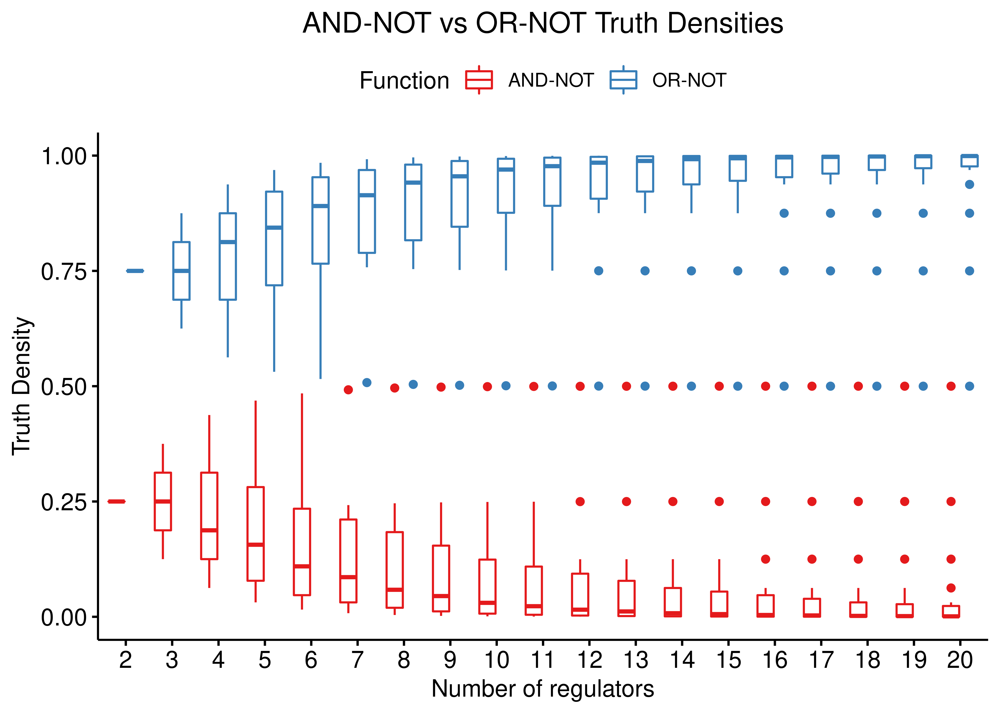
<p class="caption">(\#fig:fig-and-or-not)AND-NOT vs OR-NOT Truth Densities across all possible activators and inhibitors combinations up to 20 regulators</p>
</div>

:::{.green-box}
- **The more regulators** there are, the more likely it is that the `AND-NOT` link operator in the boolean equation will result in an **inhibited** target and that the `OR-NOT` link operator in an **active** target.
- For $n>6$ regulators, the points outside the boxplots (with a truth density of $\frac{1}{2}, \frac{1}{4}, 1-\frac{1}{4},\frac{1}{8},1-\frac{1}{8},...$) correspond to the **asymptotic behavior** of the truth density formulas shown [above](#asymptotic-behavior) where there is a large difference between the **number of activators and inhibitors** ($k \ll m$ for the `AND-NOT` case, e.g. $1,2,...$ inhibitors only or $m \ll k$ for the `OR-NOT` case, i.e. $1,2,...$ activators).
:::

We can also check the relation between TD and number of activators and inhibitors in each case.
The following figures demonstrate that the asymptotic behaviour of the truth density of the `AND-NOT` link operator function is largely dependent on the number of **inhibitors** and not on the number of **activators**:

```r
ggscatter(data = stats %>% rename(`#Regulators` = num_reg), x = "num_inh", 
  y = "td_and_not", color = "#Regulators",
  ylab = "Truth Density", xlab = "Number of Inhibitors", 
  title = "AND-NOT TD vs Number of Inhibitors") + 
  theme(plot.title = element_text(hjust = 0.5)) +
  ylim(c(0,1))

ggscatter(data = stats %>% rename(`#Regulators` = num_reg), x = "num_act", 
  y = "td_and_not", color = "#Regulators",
  ylab = "Truth Density", xlab = "Number of Activators", 
  title = "AND-NOT TD vs Number of Activators") + 
  theme(plot.title = element_text(hjust = 0.5)) +
  ylim(c(0,1))
```

<div class="figure">
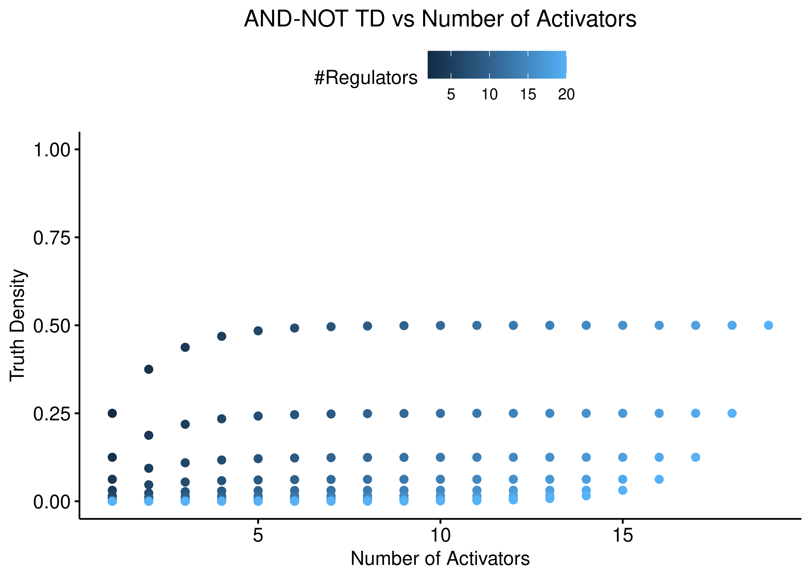
<p class="caption">(\#fig:and-not-reg-plot)AND-NOT TD vs Number of Activators and Inhibitors</p>
</div>

The reverse situation is true for the `OR-NOT` case: 

```r
ggscatter(data = stats %>% rename(`#Regulators` = num_reg), 
  x = "num_inh", y = "td_or_not", color = "#Regulators",
  ylab = "Truth Density", xlab = "Number of Inhibitors", 
  title = "OR-NOT TD vs Number of Inhibitors") + 
  theme(plot.title = element_text(hjust = 0.5)) +
  ylim(c(0,1))

ggscatter(data = stats %>% rename(`#Regulators` = num_reg), 
  x = "num_act", y = "td_or_not", color = "#Regulators",
  ylab = "Truth Density", xlab = "Number of Activators", 
  title = "OR-NOT TD vs Number of Activators") + 
  theme(plot.title = element_text(hjust = 0.5)) +
  ylim(c(0,1))
```

<div class="figure">
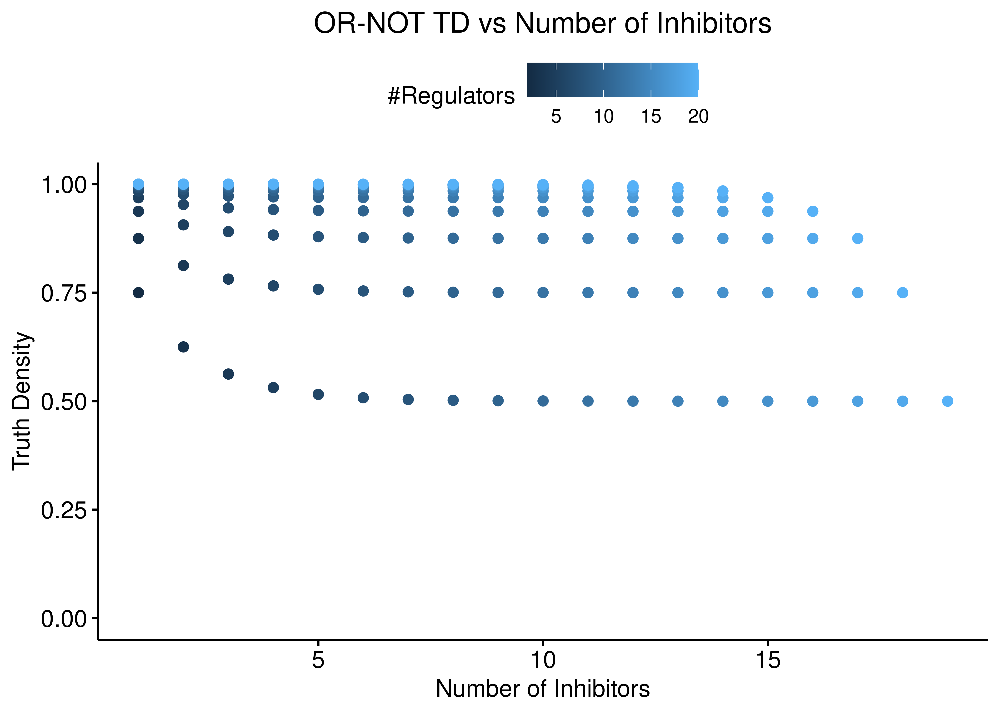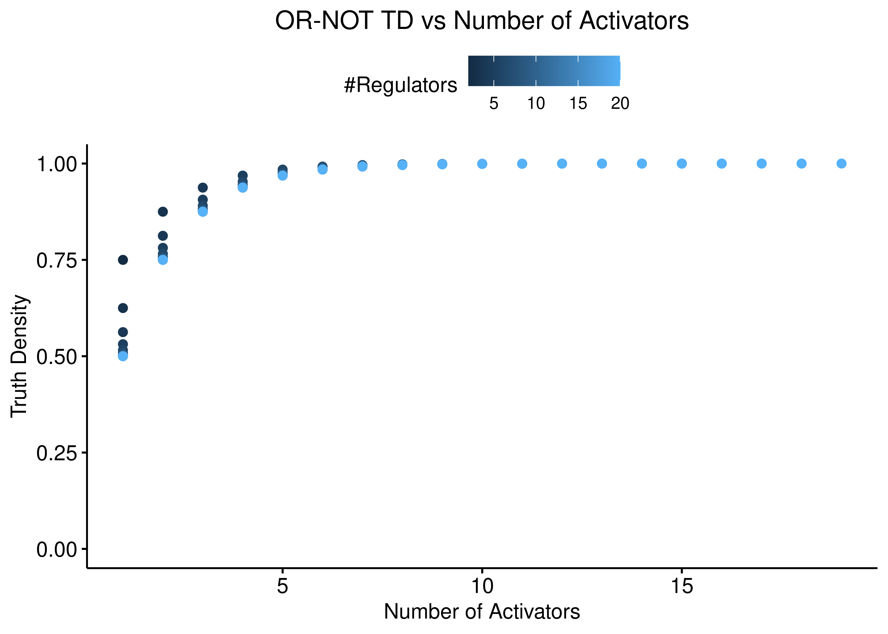
<p class="caption">(\#fig:or-not-reg-plot)OR-NOT TD vs Number of Activators and Inhibitors</p>
</div>

## *Pairs* TD {-}

If we add the `Pairs` TD results to the first plot we have:

```r
# tidy up data
stats_and_or_pairs = tidyr::pivot_longer(data = stats, cols = c(td_and_not, td_or_not, td_pairs), 
  names_to = "lo", values_to = "td") %>%
  select(num_reg, lo, td) %>%
  mutate(lo = replace(x = lo, list = lo == "td_and_not", values = "AND-NOT")) %>%
  mutate(lo = replace(x = lo, list = lo == "td_or_not", values = "OR-NOT")) %>%
  mutate(lo = replace(x = lo, list = lo == "td_pairs", values = "Pairs")) %>%
  rename(`Function` = lo)

ggboxplot(data = stats_and_or_pairs, x = "num_reg", y = "td", 
  color = "Function", palette = "Set1",
  title = "Truth Densities of boolean functions AND-NOT, OR-NOT and Pairs", 
  xlab = "Number of regulators", ylab = "Truth Density") +
  theme(plot.title = element_text(hjust = 0.5))
```

<div class="figure" style="text-align: center">
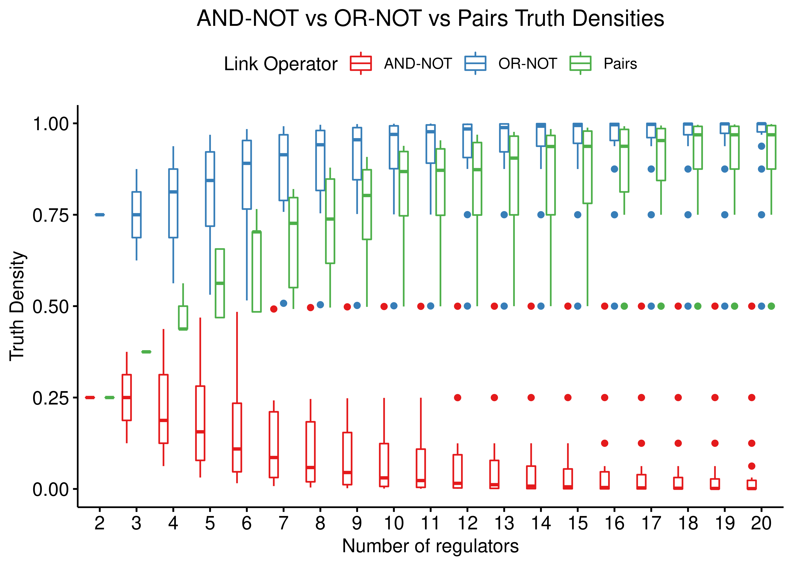
<p class="caption">(\#fig:fig-and-or-pairs-tds)AND-NOT vs OR-NOT vs Pairs Truth Densities across all possible activators and inhibitors combinations up to 20 regulators</p>
</div>

:::{.green-box}
- The `Pairs` TD values are closer to the TD values of the `OR-NOT` formula compared to the `AND-NOT` one.
- The `Pairs` is less *biased* compared to the `OR-NOT` link operator, but still for large $n$ (regulators) it practically **makes the target active**.
:::

As we can see in the following two figures, the `Pairs` shows a more balanced dependency between the number of activators and inhibitors:

```r
ggscatter(data = stats %>% rename(`#Regulators` = num_reg), x = "num_inh", 
  y = "td_pairs", color = "#Regulators",
  ylab = "Truth Density", xlab = "Number of Inhibitors", 
  title = "Pairs TD vs Number of Inhibitors") + 
  theme(plot.title = element_text(hjust = 0.5)) +
  ylim(c(0,1))

ggscatter(data = stats %>% rename(`#Regulators` = num_reg), x = "num_act", 
  y = "td_pairs", color = "#Regulators",
  ylab = "Truth Density", xlab = "Number of Activators", 
  title = "Pairs TD vs Number of Activators") + 
  theme(plot.title = element_text(hjust = 0.5)) +
  ylim(c(0,1))
```

<div class="figure">
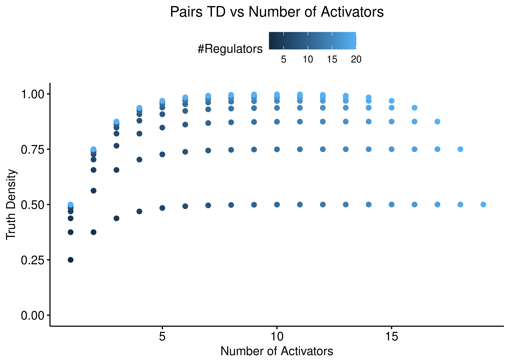
<p class="caption">(\#fig:pairs-reg-plot)Pairs TD vs Number of Activators and Inhibitors</p>
</div>

## Threshold Functions TD {-}

In contrast, if we check the truth density of the $f_{act-win}(x,y)$ and $f_{inh-win}(x,y)$ boolean functions we have:

```r
# tidy up data
stats_functions = tidyr::pivot_longer(data = stats, cols = c(td_act_win, td_inh_win), 
  names_to = "fun", values_to = "td") %>%
  select(num_reg, fun, td) %>%
  mutate(fun = replace(x = fun, list = fun == "td_act_win", values = "Activators Win")) %>%
  mutate(fun = replace(x = fun, list = fun == "td_inh_win", values = "Inhibitors Win")) %>%
  rename(`Function` = fun)

ggboxplot(data = stats_functions, x = "num_reg", y = "td",
  color = "Function", palette = "lancet",
  title = latex2exp::TeX("Truth Densities of threshold functions $f_{act-win}(x,y)$ and $f_{inh-win}(x,y)$"),
  xlab = "Number of regulators", ylab = "Truth Density") +
  theme(plot.title = element_text(hjust = 0.5)) +
  geom_hline(yintercept = 0.5, linetype="dashed", color = "black")
```

<div class="figure" style="text-align: center">
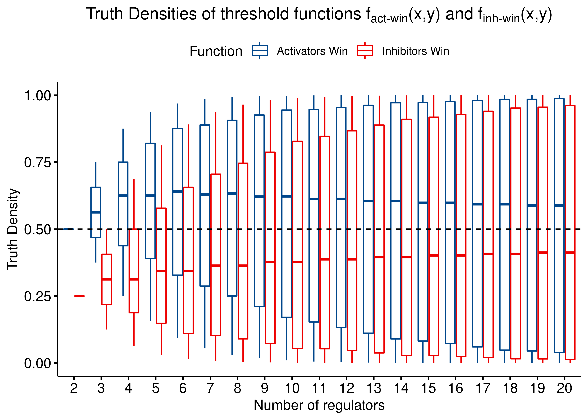
<p class="caption">(\#fig:fig-two-bool-formulas)Truth Desities of two robust boolean formulas across all possible activators and inhibitors combinations up to 20 regulators</p>
</div>

:::{.green-box}
- Both boolean functions show a **large variance of truth densities** irrespective of the number of regulators, since the values inside the boxplots represent the middle $50\%$ of the data and span across the $(0,1)$ range.
- The median truth density values seem to converge to $1/2$ for both formulas and this is how a proper *balanced* boolean function behaves :) less bias to the truth density values for increasing number of regulators results in a more *fair or balanced* boolean formula.
- The median value of truth density for the $f_{act-win}(x,y)$ is always larger than the $f_{inh-win}(x,y)$ (as expected).
:::

## TD Data Distance {-}

We check how close are the truth density values of the different proposed boolean regulatory functions, also compared to the **proportion of activators**, e.g. if a function has $1$ activator and $5$ inhibitors (resp. $5$ activators and $1$ inhibitor) I would expect the boolean regulatory function's output to be statistically more *inhibited* (resp. *activated*).
We find the *euclidean distance* between the different truth density values and show them in a data table:


```r
x = rbind(`Proportion of Activators` = stats %>% mutate(act_prop = num_act/num_reg) %>% pull(act_prop),
  `AND-NOT TD` = stats %>% pull(td_and_not),
  `OR-NOT TD` = stats %>% pull(td_or_not),
  `Pairs TD` = stats %>% pull(td_pairs),
  `Act-win TD` = stats %>% pull(td_act_win),
  `Inh-win TD` = stats %>% pull(td_inh_win))

d = dist(x, method = "euclidean")
```


```r
# color `act_prop` column
breaks = quantile(unname(as.matrix(d)[, "Proportion of Activators"]), probs = seq(.05, .95, .05), na.rm = TRUE)
col = round(seq(255, 40, length.out = length(breaks) + 1), 0) %>%
  {paste0("rgb(255,", ., ",", ., ")")} # red

caption.title = "Euclidean Distances between vectors of truth density values (Symmetric)"
DT::datatable(data = d %>% as.matrix(), options = list(dom = "t", scrollX = TRUE),
  caption = htmltools::tags$caption(caption.title, style="color:#dd4814; font-size: 18px")) %>% 
  formatRound(1:6, digits = 3) %>%
  formatStyle(columns = c("Proportion of Activators"), backgroundColor = styleInterval(breaks, col))
```

<!--html_preserve--><div id="htmlwidget-80360090829873a18c59" style="width:100%;height:auto;" class="datatables html-widget"></div>
<script type="application/json" data-for="htmlwidget-80360090829873a18c59">{"x":{"filter":"none","caption":"<caption style=\"color:#dd4814; font-size: 18px\">Euclidean Distances between vectors of truth density values (Symmetric)<\/caption>","data":[["Proportion of Activators","AND-NOT TD","OR-NOT TD","Pairs TD","Act-win TD","Inh-win TD"],[0,6.2357551189418,6.2357551189418,6.23071307451427,2.37324587183497,2.37324587183497],[6.2357551189418,0,11.5854262787016,10.842296589664,7.82178323744214,6.7696332482574],[6.2357551189418,11.5854262787016,0,2.49443825784938,6.7696332482574,7.82178323744214],[6.23071307451427,10.842296589664,2.49443825784938,0,7.12290730774761,7.92299559783636],[2.37324587183497,7.82178323744214,6.7696332482574,7.12290730774761,0,1.86374127113628],[2.37324587183497,6.7696332482574,7.82178323744214,7.92299559783636,1.86374127113628,0]],"container":"<table class=\"display\">\n  <thead>\n    <tr>\n      <th> <\/th>\n      <th>Proportion of Activators<\/th>\n      <th>AND-NOT TD<\/th>\n      <th>OR-NOT TD<\/th>\n      <th>Pairs TD<\/th>\n      <th>Act-win TD<\/th>\n      <th>Inh-win TD<\/th>\n    <\/tr>\n  <\/thead>\n<\/table>","options":{"dom":"t","scrollX":true,"columnDefs":[{"targets":1,"render":"function(data, type, row, meta) {\n    return type !== 'display' ? data : DTWidget.formatRound(data, 3, 3, \",\", \".\");\n  }"},{"targets":2,"render":"function(data, type, row, meta) {\n    return type !== 'display' ? data : DTWidget.formatRound(data, 3, 3, \",\", \".\");\n  }"},{"targets":3,"render":"function(data, type, row, meta) {\n    return type !== 'display' ? data : DTWidget.formatRound(data, 3, 3, \",\", \".\");\n  }"},{"targets":4,"render":"function(data, type, row, meta) {\n    return type !== 'display' ? data : DTWidget.formatRound(data, 3, 3, \",\", \".\");\n  }"},{"targets":5,"render":"function(data, type, row, meta) {\n    return type !== 'display' ? data : DTWidget.formatRound(data, 3, 3, \",\", \".\");\n  }"},{"targets":6,"render":"function(data, type, row, meta) {\n    return type !== 'display' ? data : DTWidget.formatRound(data, 3, 3, \",\", \".\");\n  }"},{"className":"dt-right","targets":[1,2,3,4,5,6]},{"orderable":false,"targets":0}],"order":[],"autoWidth":false,"orderClasses":false,"rowCallback":"function(row, data) {\nvar value=data[1]; $(this.api().cell(row, 1).node()).css({'background-color':isNaN(parseFloat(value)) ? '' : value <= 0.5933 ? \"rgb(255,255,255)\" : value <= 1.1866 ? \"rgb(255,244,244)\" : value <= 1.7799 ? \"rgb(255,232,232)\" : value <= 2.3732 ? \"rgb(255,221,221)\" : value <= 2.3732 ? \"rgb(255,210,210)\" : value <= 2.3732 ? \"rgb(255,198,198)\" : value <= 2.3732 ? \"rgb(255,187,187)\" : value <= 2.3732 ? \"rgb(255,176,176)\" : value <= 3.3376 ? \"rgb(255,164,164)\" : value <= 4.302 ? \"rgb(255,153,153)\" : value <= 5.2663 ? \"rgb(255,142,142)\" : value <= 6.2307 ? \"rgb(255,131,131)\" : value <= 6.232 ? \"rgb(255,119,119)\" : value <= 6.2332 ? \"rgb(255,108,108)\" : value <= 6.2345 ? \"rgb(255,97,97)\" : value <= 6.2358 ? \"rgb(255,85,85)\" : value <= 6.2358 ? \"rgb(255,74,74)\" : value <= 6.2358 ? \"rgb(255,63,63)\" : value <= 6.2358 ? \"rgb(255,51,51)\" : \"rgb(255,40,40)\"});\n}"}},"evals":["options.columnDefs.0.render","options.columnDefs.1.render","options.columnDefs.2.render","options.columnDefs.3.render","options.columnDefs.4.render","options.columnDefs.5.render","options.rowCallback"],"jsHooks":[]}</script><!--/html_preserve-->


```r
plot(hclust(dist(d)), main = "Dendogram of Truth Density Distances between various BRFs",
  ylab = "Euclidean Distance", sub = "Boolean Regulatory Functions (BRFs)", xlab = "")
```

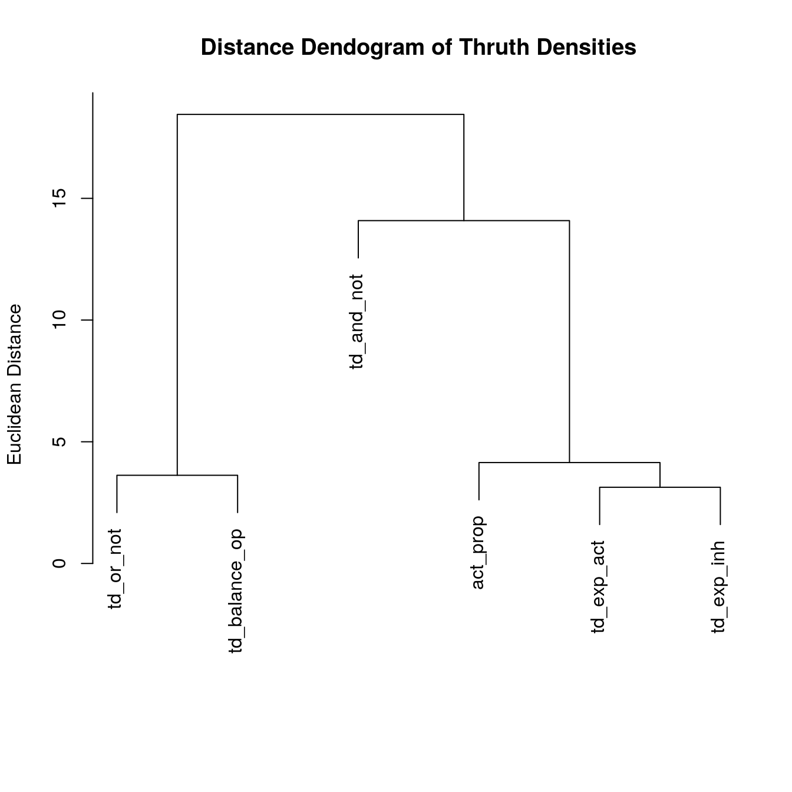

:::{.green-box}
- The **threshold functions** have truth densities values that are **closer to the proportion of activators** for a varying number of regulators, compared to the `AND-NOT` and `OR-NOT` formulas.
As such they might represent better candidates for boolean regulatory functions from this (statistical) point of view.
- The TD values of `OR-NOT` and `Pairs` are in general very close (as we've also seen in a previous figure)
:::

## Complexity vs Truth Density {-}

In [@Gherardi2016], the authors present figures measuring the **complexity** of boolean functions based on a formula that counts the number of conjunctions in the minimized DNF form (lets call this $con_{DNF_{min}}$) vs the **bias** (which is their terminology for our **truth density**!).
Since we already have the calculated the TD values for the `AND-NOT`, `OR-NOT` and `Pairs` functions in our [test data](#tr-data) and their respective (minimum) DNFs (for the `AND-NOT` and `OR-NOT` DNFs see the proofs [above](#truth-density-formulas) and for the `Pairs` DNF, see [definition](#pairs-fun)), we can measure the $con_{DNF_{min}}$ as:

- $con_{AND-NOT,DNF_{min}} = m$ (number of activators)
- $con_{OR-NOT,DNF_{min}} = m + 1$ (number of activators + 1)
- $con_{Pairs,DNF_{min}} = m \times k$ (number of activators x number of inhibitors)

We notice that the `AND-NOT` and `OR-NOT` functions have similar $con_{DNF_{min}}$ and so we would expect them to have similar complexities, whereas the `Pairs` function should be more complex than both of them.

Dividing the number of conjunctions in the DNF with the number of rows of the corresponding truth table ($2^n$), we get the complexity score as defined in [@Gherardi2016].
The complexity as it is defined, ranges between $[0,0.5]$, where the highest possible complexity ($0.5$) is due to the *parity* function, which outputs $1$ for half of the rows in the truth table, i.e. when the number of input $1$'s is odd.

Firstly, we calculate the complexity score for each data point:

```r
stats = stats %>% 
  mutate(complex_and_not = num_act/(2^num_reg)) %>%
  mutate(complex_or_not = (num_act + 1)/(2^num_reg)) %>% 
  mutate(complex_pairs = (num_act * num_inh)/(2^num_reg))
```

Next, we subset the dataset to the boolean formulas with less than $10$ regulators and separately to the formulas with more than $10$ regulators, and group the complexity scores according to the three different functions they belong, namely the `AND-NOT`, `OR-NOT` and `Pairs`:

```r
my_comp = list(c("andnot","ornot"), c("andnot","pairs"), c("ornot","pairs"))

stats %>% 
  filter(num_reg < 10) %>%
  select(starts_with('complex')) %>%
  rename(andnot = complex_and_not, ornot = complex_or_not, pairs = complex_pairs) %>%
  tidyr::pivot_longer(cols = everything(), names_to = 'class', values_to = 'c') %>% 
  ggplot(aes(x = class, y = c, fill = class)) + 
  geom_boxplot(show.legend = FALSE) +
  ggpubr::stat_compare_means(comparisons = my_comp, method = "wilcox.test", label = "p.format") +
  scale_fill_brewer(palette = 'Set1') +
  scale_x_discrete(labels = c('AND-NOT', 'OR-NOT', 'Pairs')) +
  scale_y_continuous(n.breaks = 6) +
  labs(x = 'Function', y = 'Complexity', title = 'Complexity per function class (less than 10 regulators)') +
  theme_classic(base_size = 14) +
  theme(axis.text.x = element_text(size = 12), axis.text.y = element_text(size = 12),
    plot.title = element_text(hjust = 0.5))

stats %>% 
  filter(num_reg > 10) %>%
  select(starts_with('complex')) %>%
  rename(andnot = complex_and_not, ornot = complex_or_not, pairs = complex_pairs) %>%
  tidyr::pivot_longer(cols = everything(), names_to = 'class', values_to = 'c') %>% 
  ggplot(aes(x = class, y = c, fill = class)) + 
  geom_boxplot(show.legend = FALSE) +
  ggpubr::stat_compare_means(comparisons = my_comp, method = "wilcox.test", label = "p.format") +
  scale_fill_brewer(palette = 'Set1') +
  scale_x_discrete(labels = c('AND-NOT', 'OR-NOT', 'Pairs')) +
  scale_y_continuous(n.breaks = 6) +
  labs(x = 'Function', y = 'Complexity', title = 'Complexity per function class (more than 10 regulators)') +
  theme_classic(base_size = 14) +
  theme(axis.text.x = element_text(size = 12), axis.text.y = element_text(size = 12),
    plot.title = element_text(hjust = 0.5))
```

<div class="figure" style="text-align: center">
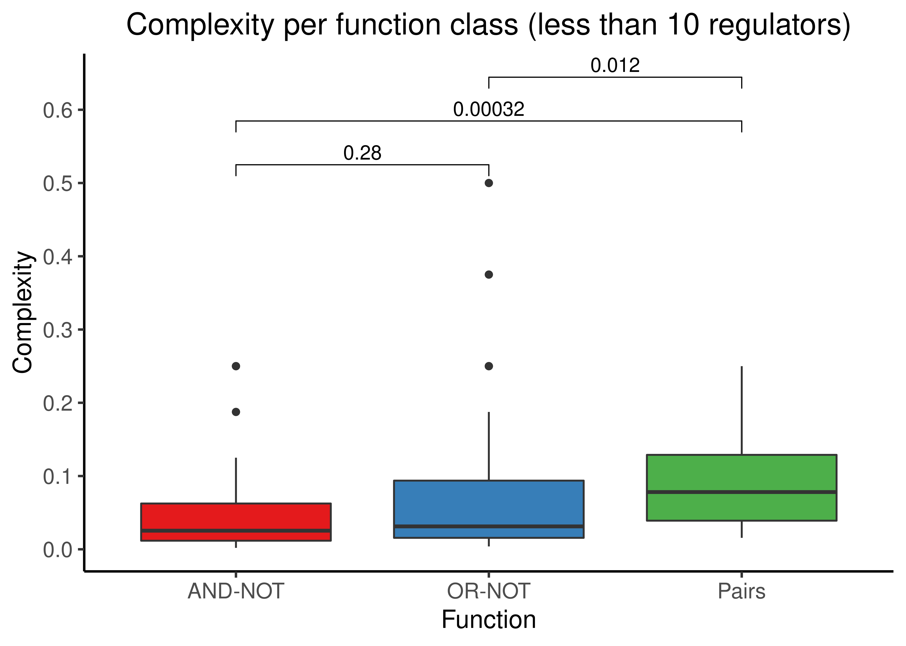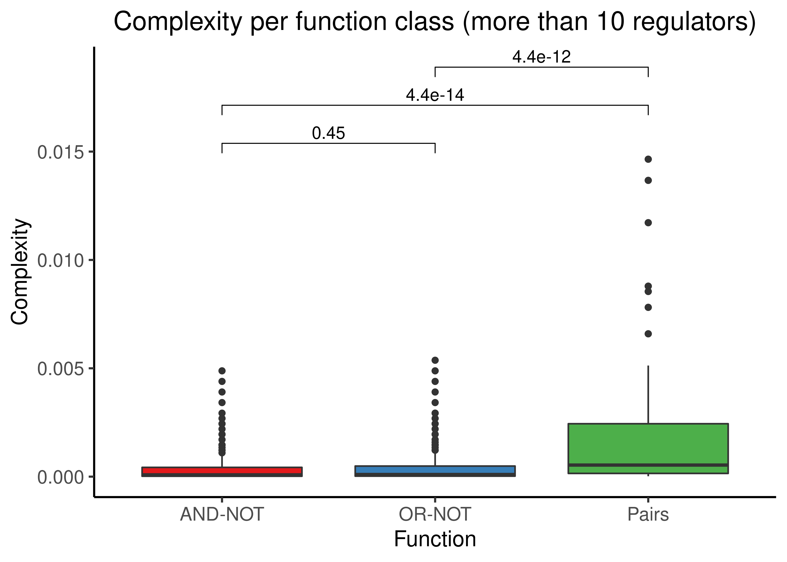
<p class="caption">(\#fig:complexity-per-function-class)Complexity scores for the AND-NOT, OR-NOT and Pairs boolean regulatory functions for every boolean formula with at least one activator and one inhibitor and either less (first figure) or more (second figure) than 10 regulators in total.</p>
</div>

:::{.green-box}
- **All three functions show low complexities (especially for $n \gt 10$)**, with `Pairs` having the higher median complexity of the three with statistical significance from the other two in both figures.
- The complexities between `AND-NOT` and `OR-NOT` do not differ significantly, as expected from their similar $con_{DNF_{min}}$ formula.
:::

We next present some Truth Density vs Complexity figures:

```r
stats %>% 
  filter(num_reg < 10) %>%
  select(starts_with('complex'), starts_with('td'), -td_act_win, -td_inh_win) %>% 
  rename(td_andnot = td_and_not, td_ornot = td_or_not, complex_andnot = complex_and_not, complex_ornot = complex_or_not) %>%
  pivot_longer(cols = everything(), names_to = c(".value", "fun"), names_sep = "_") %>% # tricky
  ggplot(aes(x = td, y = complex, color = fun)) +
  geom_point(alpha = 0.6) +
  scale_color_brewer(palette = 'Set1', name = 'Function', 
    labels = c('AND-NOT','OR-NOT','Pairs'), 
    guide = guide_legend(label.theme = element_text(size = 12), 
      override.aes = list(shape = 19, size = 12))) +
  geom_smooth(mapping = aes(x = td, y = complex, fill = fun), method = 'loess', formula = y ~ x, show.legend = FALSE) +
  scale_fill_brewer(palette = 'Set1') + 
  labs(x = 'Truth Density (TD)', y = 'Complexity (C)', title = 'Truth Density vs Complexity (less than 10 regulators)') +
  theme_classic(base_size = 14) +
  theme(axis.text.x = element_text(size = 12), axis.text.y = element_text(size = 12),
    plot.title = element_text(hjust = 0.5))

stats %>% 
  filter(num_reg > 10) %>%
  select(starts_with('complex'), starts_with('td'), -td_act_win, -td_inh_win) %>% 
  rename(td_andnot = td_and_not, td_ornot = td_or_not, complex_andnot = complex_and_not, complex_ornot = complex_or_not) %>%
  pivot_longer(cols = everything(), names_to = c(".value", "fun"), names_sep = "_") %>% # tricky
  ggplot(aes(x = td, y = complex, color = fun)) +
  geom_point(alpha = 0.6) +
  scale_color_brewer(palette = 'Set1', name = 'Function', labels = c('AND-NOT','OR-NOT','Pairs'),
    guide = guide_legend(label.theme = element_text(size = 12), 
      override.aes = list(shape = 19, size = 12))) +
  geom_smooth(mapping = aes(x = td, y = complex, fill = fun), method = 'loess', formula = y ~ x, show.legend = FALSE) +
  scale_fill_brewer(palette = 'Set1') + 
  labs(x = 'Truth Density (TD)', y = 'Complexity (C)', title = 'Truth Density vs Complexity (more than 10 regulators)') +
  theme_classic(base_size = 14) +
  theme(axis.text.x = element_text(size = 12), axis.text.y = element_text(size = 12),
    plot.title = element_text(hjust = 0.5))
```

<div class="figure" style="text-align: center">
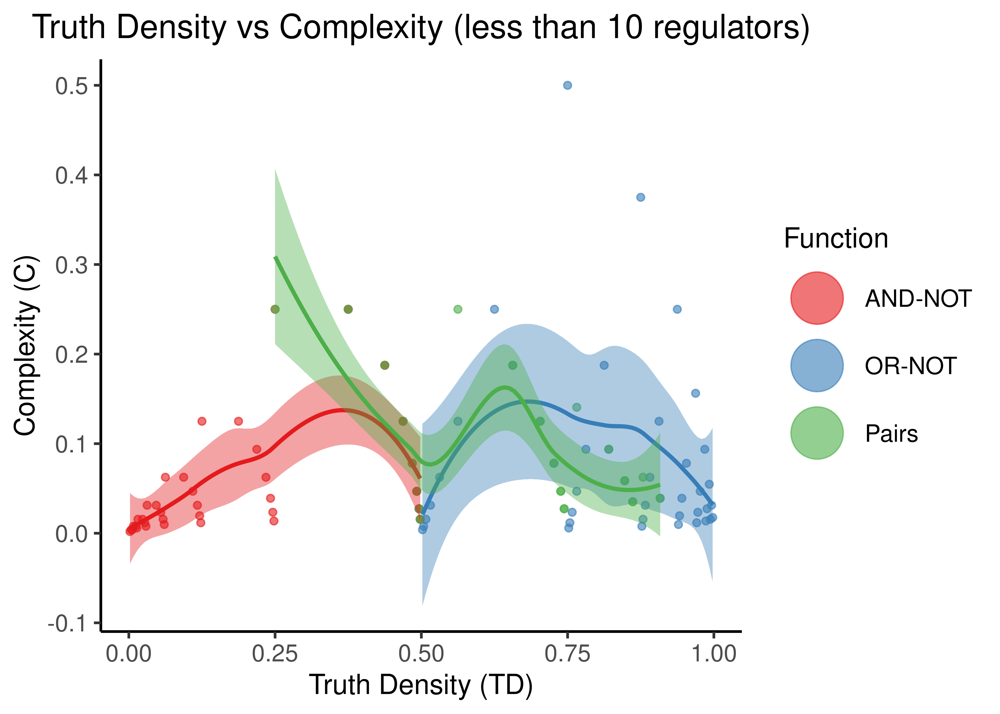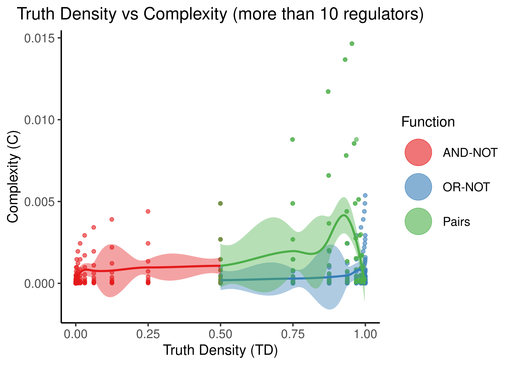
<p class="caption">(\#fig:td-vs-complexity-1)Truth Density vs Complexity for the AND-NOT, OR-NOT and Pairs boolean regulatory functions. Each point represents a different boolean formula with at least one activator and one inhibitor. The number of total regulators ranges from 2 to 9 in the first figure and 11 to 20 in the second.</p>
</div>

If we put all data together, we have:

```r
stats %>% 
  select(starts_with('complex'), starts_with('td'), -td_act_win, -td_inh_win) %>% 
  rename(td_andnot = td_and_not, td_ornot = td_or_not, complex_andnot = complex_and_not, complex_ornot = complex_or_not) %>%
  pivot_longer(cols = everything(), names_to = c(".value", "fun"), names_sep = "_") %>% # tricky
  ggplot(aes(x = td, y = complex, color = fun)) +
  geom_point(alpha = 0.6) +
  scale_color_brewer(palette = 'Set1', name = 'Function', labels = c('AND-NOT','OR-NOT','Pairs'),
    guide = guide_legend(label.theme = element_text(size = 12), 
      override.aes = list(shape = 19, size = 12))) +
  geom_smooth(mapping = aes(x = td, y = complex, fill = fun), method = 'loess', formula = y ~ x, show.legend = FALSE) +
  scale_fill_brewer(palette = 'Set1') + 
  labs(x = 'Truth Density (TD)', y = 'Complexity (C)', title = 'Truth Density vs Complexity') +
  theme_classic(base_size = 14) +
  theme(axis.text.x = element_text(size = 12), axis.text.y = element_text(size = 12),
    plot.title = element_text(hjust = 0.5))
```

<div class="figure" style="text-align: center">
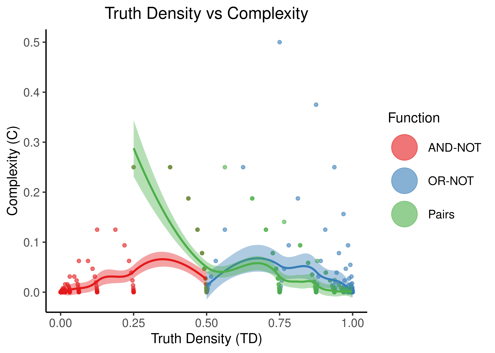
<p class="caption">(\#fig:td-vs-complexity-2)Truth Density vs Complexity for the AND-NOT, OR-NOT and Pairs boolean regulatory functions. Each point represents a different boolean formula with at least one activator and one inhibitor. The number of total regulators ranges from 2 to 20 in total.</p>
</div>

:::{.green-box}
- `Pairs` covers more TD spectrum than the other two functions, while the `AND-NOT` and `OR-NOT` dichotomize it.
- TD values are very discretized: points tend to cluster at points that denote either the truth density bias (e.g. $0,1$) or the cases where there is an unbalance between number of activators and inhibitors (e.g. $1/2^n$)
- `Pairs` shows higher complexity than the other two functions when the number of regulators is higher (e.g. more than $10$ regulators) but the difference is not significant since the size of the truth table ($2^{10}$) becomes the dominating term in the complexity score.
So, in general, as observed in [@Gherardi2016], **these boolean regulatory functions have very low complexity, especially for larger number of regulators**.
:::

If we restrict the shown values to a **specific number of total regulators**, we have the following example figures:

```r
stats %>% 
  filter(num_reg == 5) %>%
  select(starts_with('complex'), starts_with('td'), -td_act_win, -td_inh_win) %>% 
  rename(td_andnot = td_and_not, td_ornot = td_or_not, complex_andnot = complex_and_not, complex_ornot = complex_or_not) %>%
  pivot_longer(cols = everything(), names_to = c(".value", "fun"), names_sep = "_") %>% # tricky
  ggplot(aes(x = td, y = complex, color = fun)) +
  geom_point(alpha = 0.6) +
  scale_color_brewer(palette = 'Set1', name = 'Function', 
    labels = c('AND-NOT','OR-NOT','Pairs'), 
    guide = guide_legend(label.theme = element_text(size = 12), 
      override.aes = list(shape = 19, size = 12))) +
  geom_line(size = 1.2, show.legend = FALSE) +
  labs(x = 'Truth Density (TD)', y = 'Complexity (C)', title = 'Truth Density vs Complexity (5 regulators)') +
  theme_classic(base_size = 14) +
  theme(axis.text.x = element_text(size = 12), axis.text.y = element_text(size = 12),
    plot.title = element_text(hjust = 0.5))

stats %>% 
  filter(num_reg == 8) %>%
  select(starts_with('complex'), starts_with('td'), -td_act_win, -td_inh_win) %>% 
  rename(td_andnot = td_and_not, td_ornot = td_or_not, complex_andnot = complex_and_not, complex_ornot = complex_or_not) %>%
  pivot_longer(cols = everything(), names_to = c(".value", "fun"), names_sep = "_") %>% # tricky
  ggplot(aes(x = td, y = complex, color = fun)) +
  geom_point(alpha = 0.6) +
  scale_color_brewer(palette = 'Set1', name = 'Function', labels = c('AND-NOT','OR-NOT','Pairs'),
    guide = guide_legend(label.theme = element_text(size = 12), 
      override.aes = list(shape = 19, size = 12))) +
  geom_line(size = 1.2, show.legend = FALSE) +
  labs(x = 'Truth Density (TD)', y = 'Complexity (C)', title = 'Truth Density vs Complexity (8 regulators)') +
  theme_classic(base_size = 14) +
  theme(axis.text.x = element_text(size = 12), axis.text.y = element_text(size = 12),
    plot.title = element_text(hjust = 0.5))

stats %>% 
  filter(num_reg == 11) %>%
  select(starts_with('complex'), starts_with('td'), -td_act_win, -td_inh_win) %>% 
  rename(td_andnot = td_and_not, td_ornot = td_or_not, complex_andnot = complex_and_not, complex_ornot = complex_or_not) %>%
  pivot_longer(cols = everything(), names_to = c(".value", "fun"), names_sep = "_") %>% # tricky
  ggplot(aes(x = td, y = complex, color = fun)) +
  geom_point(alpha = 0.6) +
  scale_color_brewer(palette = 'Set1', name = 'Function', labels = c('AND-NOT','OR-NOT','Pairs'),
    guide = guide_legend(label.theme = element_text(size = 12), 
      override.aes = list(shape = 19, size = 12))) +
  geom_line(size = 1.2, show.legend = FALSE) +
  labs(x = 'Truth Density (TD)', y = 'Complexity (C)', title = 'Truth Density vs Complexity (11 regulators)') +
  theme_classic(base_size = 14) +
  theme(axis.text.x = element_text(size = 12), axis.text.y = element_text(size = 12),
    plot.title = element_text(hjust = 0.5))

stats %>% 
  filter(num_reg == 14) %>%
  select(starts_with('complex'), starts_with('td'), -td_act_win, -td_inh_win) %>% 
  rename(td_andnot = td_and_not, td_ornot = td_or_not, complex_andnot = complex_and_not, complex_ornot = complex_or_not) %>%
  pivot_longer(cols = everything(), names_to = c(".value", "fun"), names_sep = "_") %>% # tricky
  ggplot(aes(x = td, y = complex, color = fun)) +
  geom_point(alpha = 0.6) +
  scale_color_brewer(palette = 'Set1', name = 'Function', labels = c('AND-NOT','OR-NOT','Pairs'),
    guide = guide_legend(label.theme = element_text(size = 12), 
      override.aes = list(shape = 19, size = 12))) +
  geom_line(size = 1.2, show.legend = FALSE) +
  labs(x = 'Truth Density (TD)', y = 'Complexity (C)', title = 'Truth Density vs Complexity (14 regulators)') +
  theme_classic(base_size = 14) +
  theme(axis.text.x = element_text(size = 12), axis.text.y = element_text(size = 12),
    plot.title = element_text(hjust = 0.5))
```

<div class="figure" style="text-align: center">
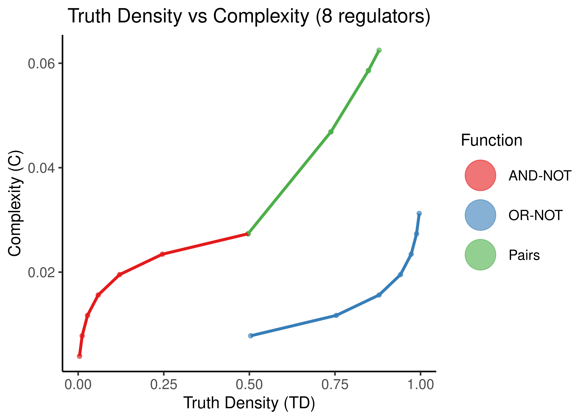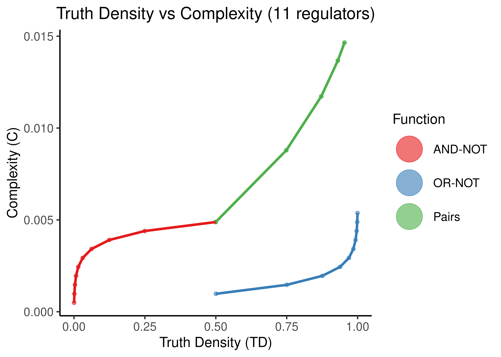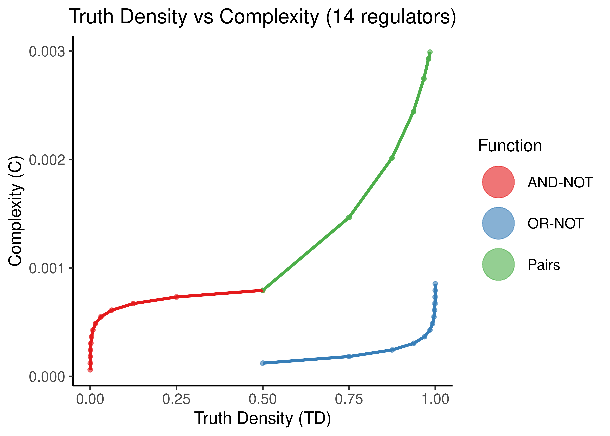
<p class="caption">(\#fig:td-vs-complexity-3)Truth Density vs Complexity for the AND-NOT, OR-NOT and Pairs boolean regulatory functions. Each point represents a different boolean formula with at least one activator and one inhibitor. In each figure, formulas with a specific number of total regulators is shown (5,8,11,14).</p>
</div>

:::{.green-box}
As observed in [@Gherardi2016] for empirical, experimentally-validated boolean functions, there seems to be a **monotonic relationship between Truth Density and Complexity** (when fixing the number of regulators to a particular value).

The more regulators, arbitrarily chosen same-type functions (points here) with different TD values, results in smaller differences of complexity.
Also the bias of the `AND-NOT` and `OR-NOT` functions can be visually shown from the large curvature of the red and blue functions for larger number of regulators.
:::

# CASCADE 1.0 Data Analysis {-}

## Data {-}

Using [abmlog](https://github.com/druglogics/abmlog) we generated all $2^{23} = 8388608$ possible link operator mutated models for the CASCADE 1.0 topology ($23$ nodes have at least one regulator from each category, i.e. an activator and an inhibitor).
The models are stored in both `.gitsbe` and `.bnet` files in the Zenodo dataset [](https://doi.org/10.5281/zenodo.4022783) (the `gitsbe` files include also the fixpoint attractors).

:::{.blue-box}
The dataset includes models with $0,1$ or $2$ stable states.
We used the [get_ss_data.R](https://github.com/bblodfon/brf-bias/blob/main/scripts/get_ss_data.R) script to get the **1 stable state data** from the models (a total of $2820224$ models - see [stable state distribution](https://bblodfon.github.io/bool-param-maps/cascade-1-0-general.html#model-stable-state-statistics)) and it's this data we are going to analyze in the next section.
:::

## Parameterization vs Activity {-}

We calculate the `node_stats` object using the [get_node_stats.R](https://github.com/bblodfon/brf-bias/blob/main/scripts/get_node_stats.R) script.
This object includes the **agreement statistics information** for each link operator node (i.e. one that is targeted by both activators and inhibitors).

Load the `node_stats`:

```r
node_stats = readRDS(file = "data/node_stats.rds")
```

:::{.note #percent-agreement-note}
We are interested in two variables of interest:

- **Parameterization** of a link operator node: `AND-NOT` (0) vs `OR-NOT` (1)
- **Stable State** of a node: *inhibited* (0) vs *active* (1)

There exist are 4 different possibilities related to 2 cases:

1. `0-0`, `1-1` => parameterization and stable state **match** (e.g. node was parameterized with `AND-NOT` and it's state was inhibited or it had `OR-NOT` and its state was active)
2. `1-0`, `0-1` => parameterization and stable state **differ** (e.g. node had `OR-NOT` and its state was inhibited, or `AND-NOT` and it's state was active)

The **percent Agreement** (or total observed proportionate agreement score) is the number of total matches (case 1 above) divided by the total number of data observations/models.

A more *robust* and *sophisticated* (compared to the percent agreement) statistic is the **Cohen's kappa coefficient** ($\kappa$). 
This statistic is used to measure the extent to which data collectors (raters) assign the same score to the same variable (interrater reliability) and takes into account the possibility of agreement occurring by chance.
In our case **one rater assigns link operator parameterization** (`AND-NOT` or $0$ vs `OR-NOT` or $1$) and **the other stable state activity** $0$ vs $1$).

In the figures showing Cohen's $\kappa$, we draw a horizontal line to indicate the value of $\kappa=0.6$ that corresponds to a *moderate* or *substantial* strength of agreement [@Landis1977; @McHugh2012a]
:::

In the next Figure we show the **percent agreement** for each node:

```r
node_stats %>% mutate(node = forcats::fct_reorder(node, desc(num_reg))) %>% 
  ggplot(aes(x = node, y = obs_prop_agreement, fill = as.factor(num_reg))) +
    geom_bar(stat = "identity") +
    scale_y_continuous(labels=scales::percent) +
    labs(title = "Agreement between Link Operator Parameterization and Stable State Activity", x = "Target Nodes with both activating and inhibiting regulators", y = "Percent Agreement") +
    theme_classic() + theme(axis.text.x = element_text(angle = 90)) +
    scale_fill_brewer(guide = guide_legend(reverse=TRUE, title = "#Regulators"), palette = "Set1") +
    geom_hline(yintercept = 0.5, linetype = 'dashed')
```

<div class="figure" style="text-align: center">
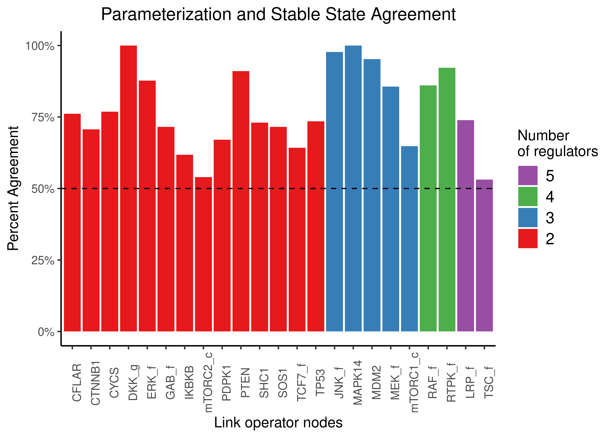
<p class="caption">(\#fig:ss-lo-agreement-prop)Parameterization and Stable State activity agreement</p>
</div>

:::{.green-box}
The total barplot area covered (i.e. the **total percent agreement score** so to speak) is **77.7294779%**.

The above score means that the is a higher probability than chance to assign a node the `AND-NOT` (resp. `OR-NOT`) link operator in its respective boolean equation and that node at the same time having an inhibited (resp. activated) stable state of $0$ (.resp $1$) in any CASCADE 1.0 link operator parameterized model.
**This suggests that the corresponding boolean formula used is biased**.
:::

In the next figures, we have **separated the nodes to groups based on the number of regulators** and show both percent agreement and Cohen's $\kappa$:

```r
node_stats %>% 
  mutate(num_reg = as.factor(num_reg)) %>%
  ggplot(aes(x = num_reg, y = obs_prop_agreement, fill = num_reg)) + 
    geom_boxplot(show.legend = FALSE) +
    geom_jitter(shape = 19, position = position_jitter(0.2), show.legend = FALSE) +
    scale_y_continuous(labels = scales::percent, limits = c(0,1)) +
    labs(title = "Agreement (parameterization vs stable state activity)", x = "Number of Regulators", y = "Percent Agreement") +
    geom_hline(yintercept = 0.5, linetype = 'dashed', color = "red") +
    theme_classic(base_size = 14) +
    theme(axis.text.x = element_text(size = 15))

node_stats %>% 
  mutate(num_reg = as.factor(num_reg)) %>%
  ggplot(aes(x = num_reg, y = cohen_k, fill = num_reg)) + 
    geom_boxplot(show.legend = FALSE) +
    geom_jitter(shape = 19, position = position_jitter(0.2), show.legend = FALSE) +
    ylim(c(0,1)) +
    labs(title = "Cohen's k (parameterization vs stable state activity)", x = "Number of Regulators", y = latex2exp::TeX("$\\kappa$")) +
    geom_hline(yintercept = 0.6, linetype = 'dashed', color = "red") +
    geom_text(aes(x = 3.4, y = 0.55, label="k = 0.6")) + 
    theme_classic(base_size = 14) +
    theme(axis.text.x = element_text(size = 15))
```

<div class="figure">
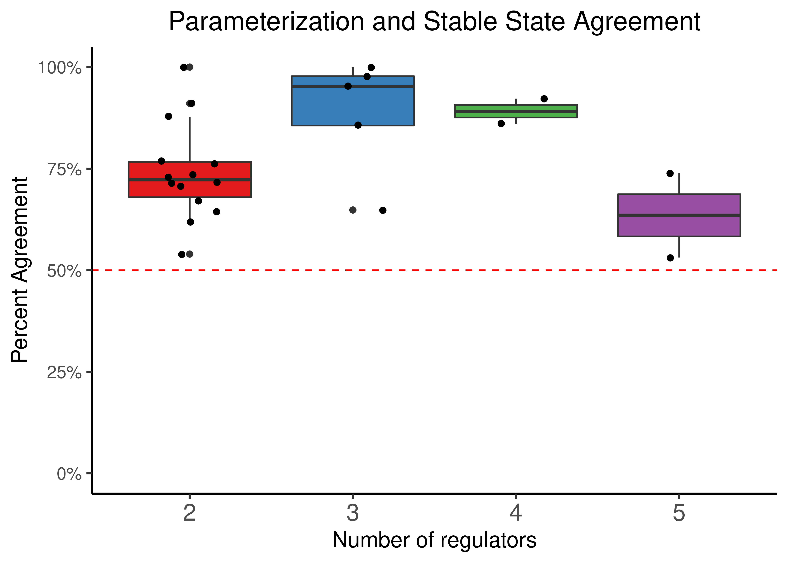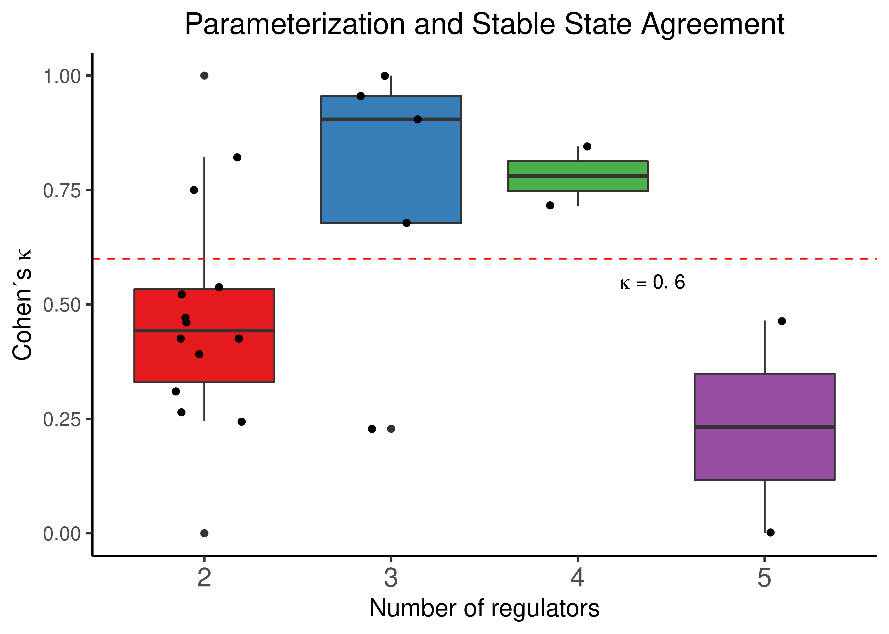
<p class="caption">(\#fig:ss-lo-agreement-prop-grouped)Parameterization and Stable State activity agreement. CASCADE 1.0 link operator nodes are grouped based on their respective number of regulators. Both percent agreement and Cohen's k are presented</p>
</div>

:::{.green-box}
We observe that even for a small number of regulators, the **median percent agreement score is higher than** $0.5$, though the corresponding Cohen's $\kappa$ score seems to be quite variant across the number of regulators.

Since Cohen's $\kappa$ is a more *strict* score to assess agreement between parameterization and stable state activity we conclude that the *truth density bias* of the standardized regulatory functions might not be quite evident from these data (**we need link operator nodes with more regulators**).
:::

Next, we calculate per node, the proportion of link operator assignments that retained their expected (i.e. keeping the same digit) stable state activity (e.g. the proportion of models corresponding to the cases `0-0`/(`0-0` + `0-1`) for the `AND-NOT` link operator - and `1-1`/(`1-1` + `1-0`) for `OR-NOT`):

```r
node_stats %>% 
  mutate(and_not_0ss_prop = and_not_0ss_agreement/(and_not_0ss_agreement + and_not_1ss_disagreement)) %>% 
  mutate(or_not_1ss_prop  = or_not_1ss_agreement/(or_not_1ss_agreement + or_not_0ss_disagreement)) %>%
  select(node, num_reg, and_not_0ss_prop, or_not_1ss_prop, active_prop) %>%
  rename(`AND-NOT` = and_not_0ss_prop, `OR-NOT` = or_not_1ss_prop) %>%
  mutate(node = forcats::fct_reorder(node, desc(num_reg))) %>%
  pivot_longer(cols = c(`AND-NOT`, `OR-NOT`)) %>%
  ggplot(aes(x = node, y = value, fill = name)) +
    geom_bar(position = "dodge", stat = "identity") +
    scale_y_continuous(labels=scales::percent) +
    labs(title = "Link Operator Parameterization Agreement with Stable State Activity", 
      x = "Target Nodes with both activating and inhibiting regulators", 
      y = "Percent Agreement") +
    theme_classic() + theme(axis.text.x = element_text(angle = 90)) + 
    scale_fill_brewer(guide = guide_legend(title = "Link Operator"), palette = "Set1") + 
    geom_line(aes(y = active_prop, color = active_prop), group = 1, size = 1.2) +
    scale_color_gradient(labels=scales::percent, low="grey", high="green", 
      name = "%Models:active node", limits = c(0,1)) + 
    theme(legend.title = element_text(size = 10))
```

<div class="figure" style="text-align: center">

<p class="caption">(\#fig:ss-comp-agreement-props)Parameterization and Stable State activity agreement 2</p>
</div>

:::{.green-box}
- Higher proportional activity for a node correlates with higher `OR-NOT`-activated state agreement.
- `LRP_f` has 4 activators and 1 inhibitor and from the previous [TD data table](#tr-data) we have that: $TD_{AND-NOT,4+1}=0.469$, $TD_{OR-NOT,4+1}=0.969$, numbers which correspond really well with the percent agreement scores found across all the CASCADE 1.0 models.
- `TSC_f` and `mTORC2_c` are always found inhibited and thus the agreement with the `AND-NOT`-inhibited state is perfect and the `OR-NOT`-activated state agreement zero.
- `TSC_f` has 1 activator and 4 inhibitors, which corresponds well to it's total inhibition profile in all the models (with significantly more inhibitors, there is a higher probability of the target node being inhibited).
The TD values are $TD_{AND-NOT,1+4}=0.03$, $TD_{OR-NOT,1+4}=0.53$ and so the percent agreement between the `AND-NOT` parameterization and the resulting $0$ stable state activity is justified, but for the `OR-NOT` cases we would expect around half of them to be in agreement (have a value of $1$ in the stable state) - which was not the case (all of them had $0$).
Probably the network dynamical configuration may have something to do with that.
:::


```r
caption.title = "Link Operator Statistics (CASCADE 1.0)"
DT::datatable(data = node_stats %>% select(node, num_reg, num_act, num_inh), 
  caption = htmltools::tags$caption(caption.title, style="color:#dd4814; font-size: 18px"),
  options = list(order = list(list(2, "desc"))))
```

<!--html_preserve--><div id="htmlwidget-89a9aad80fc85b4de79a" style="width:100%;height:auto;" class="datatables html-widget"></div>
<script type="application/json" data-for="htmlwidget-89a9aad80fc85b4de79a">{"x":{"filter":"none","caption":"<caption style=\"color:#dd4814; font-size: 18px\">Link Operator Statistics (CASCADE 1.0)<\/caption>","data":[["1","2","3","4","5","6","7","8","9","10","11","12","13","14","15","16","17","18","19","20","21","22","23"],["mTORC2_c","JNK_f","MAPK14","RTPK_f","MEK_f","SHC1","PTEN","SOS1","ERK_f","RAF_f","mTORC1_c","GAB_f","PDPK1","IKBKB","TSC_f","TP53","MDM2","CYCS","CFLAR","LRP_f","CTNNB1","TCF7_f","DKK_g"],[2,3,3,4,3,2,2,2,2,4,3,2,2,2,5,2,3,2,2,5,2,2,2],[1,2,2,2,2,1,1,1,1,1,2,1,1,1,1,1,2,1,1,4,1,1,1],[1,1,1,2,1,1,1,1,1,3,1,1,1,1,4,1,1,1,1,1,1,1,1]],"container":"<table class=\"display\">\n  <thead>\n    <tr>\n      <th> <\/th>\n      <th>node<\/th>\n      <th>num_reg<\/th>\n      <th>num_act<\/th>\n      <th>num_inh<\/th>\n    <\/tr>\n  <\/thead>\n<\/table>","options":{"order":[[2,"desc"]],"columnDefs":[{"className":"dt-right","targets":[2,3,4]},{"orderable":false,"targets":0}],"autoWidth":false,"orderClasses":false}},"evals":[],"jsHooks":[]}</script><!--/html_preserve-->

# CASCADE 2.0 Data Analysis {-}

:::{.blue-box}
We will perform the same analysis as in the previous section, only now for a **randomly selected sample of models from the CASCADE 2.0 topology**.

CASCADE 2.0 represents a larger topology/network with nodes with more than $5$ regulators and as such we expect to see even more agreement between stable state activity and link operator assignment for these nodes (which will be a proof-of-concept for the link operator bias).
:::

## Data {-}

:::{.note}
The dataset used was generated for [another analysis](https://bblodfon.github.io/gitsbe-model-analysis/cascade/random-model-ss/main.html) and we are going to use part of it, i.e. the **models that had 1 stable state** (see [get_node_stats_cascade_2.R](https://github.com/bblodfon/brf-bias/blob/main/scripts/get_node_stats_cascade_2.R) script).
The dataset is stored in Zenodo [](https://doi.org/10.5281/zenodo.3932382)
:::

Load the CASCADE 2.0 `node_stats_cascade2`:

```r
node_stats_cascade2 = readRDS(file = "data/node_stats_cascade2.rds")
```

## Parameterization vs Activity {-}

The next Figure shows the **total percent agreement** for each link operator node in CASCADE 2.0 (a total of $52$ nodes), which is the number of models for which **parameterization and stable state matched** divided by the total amount of models ($20672$):

```r
node_stats_cascade2 %>% mutate(node = forcats::fct_reorder(node, desc(num_reg))) %>% 
  ggplot(aes(x = node, y = obs_prop_agreement, fill = as.factor(num_reg))) +
    geom_bar(stat = "identity") +
    scale_y_continuous(labels=scales::percent) +
    labs(title = "Agreement between Link Operator Parameterization and Stable State Activity", x = "Target Nodes with both activating and inhibiting regulators", y = "Percent Agreement") +
    theme_classic() + theme(axis.text.x = element_text(angle = 90)) +
    scale_fill_brewer(guide = guide_legend(reverse=TRUE, title = "#Regulators"), palette = "Spectral") +
    geom_hline(yintercept = 0.5, linetype = 'dashed')
```

<div class="figure" style="text-align: center">
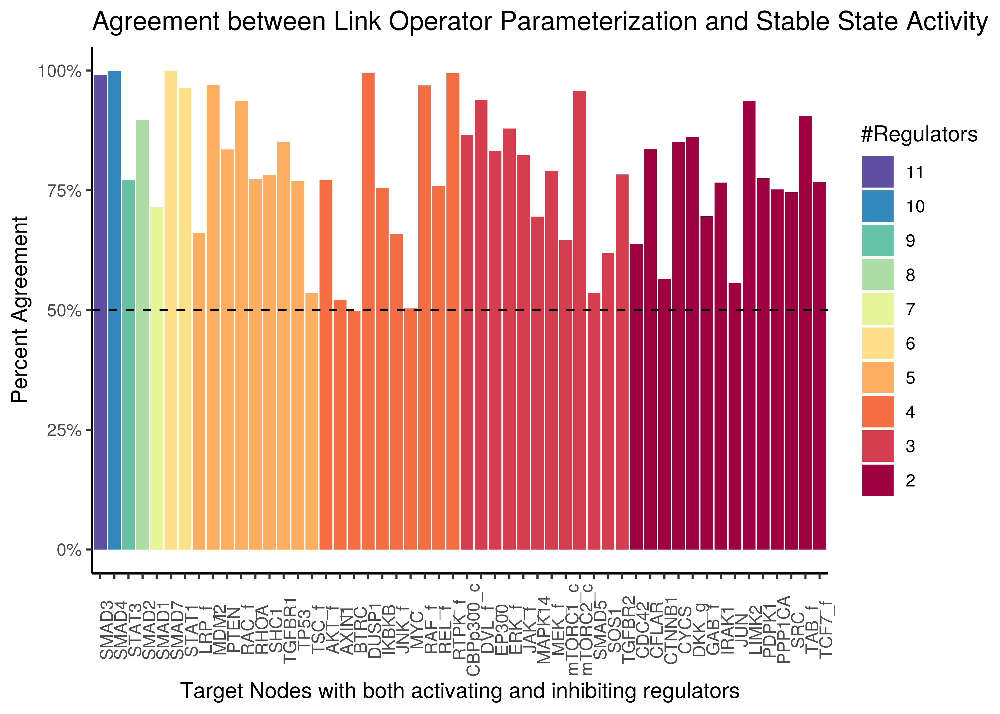
<p class="caption">(\#fig:ss-lo-prop-aggreement-cascade2)Parameterization and Stable State activity agreement (CASCADE 2.0)</p>
</div>
:::{.green-box}
The total barplot area covered (i.e. the **total agreement score** so to speak) is **78.6334916%**.
:::

In the next two figures, we separate the nodes to $3$ groups based on the number of regulators they have and show both the percent agreement and Cohen's $\kappa$ statistic (see [note](#percent-agreement-note)):

```r
node_stats_cascade2 %>% mutate(reg_group = 
    factor(case_when(num_reg >= 6 ~ ">5", num_reg <= 3 ~ "2-3", TRUE ~ "4-5"), levels = c("2-3", "4-5", ">5"))) %>%
  ggplot(aes(x = reg_group, y = obs_prop_agreement, fill = reg_group)) + 
    geom_boxplot(show.legend = FALSE) +
    geom_jitter(shape = 19, position = position_jitter(0.2), show.legend = FALSE) +
    scale_y_continuous(labels = scales::percent, limits = c(0,1)) +
    labs(title = "Agreement (parameterization vs stable state activity)", x = "Number of Regulators", y = "Percent Agreement") +
    geom_hline(yintercept = 0.5, linetype = 'dashed', color = "red") +
    theme_classic(base_size = 14) +
    theme(axis.text.x = element_text(size = 15))

node_stats_cascade2 %>% mutate(reg_group = 
    factor(case_when(num_reg >= 6 ~ ">5", num_reg <= 3 ~ "2-3", TRUE ~ "4-5"), levels = c("2-3", "4-5", ">5"))) %>%
  ggplot(aes(x = reg_group, y = cohen_k, fill = reg_group)) + 
    geom_boxplot(show.legend = FALSE) +
    geom_jitter(shape = 19, position = position_jitter(0.2), show.legend = FALSE) +
    ylim(c(0,1)) +
    labs(title = "Cohen's k (parameterization vs stable state activity)", x = "Number of Regulators", y = latex2exp::TeX("$\\kappa$")) +
    geom_hline(yintercept = 0.6, linetype = 'dashed', color = "red") +
    geom_text(aes(x = 3.4, y = 0.55, label="k = 0.6")) + 
    theme_classic(base_size = 14) +
    theme(axis.text.x = element_text(size = 15))
```

<div class="figure" style="text-align: center">
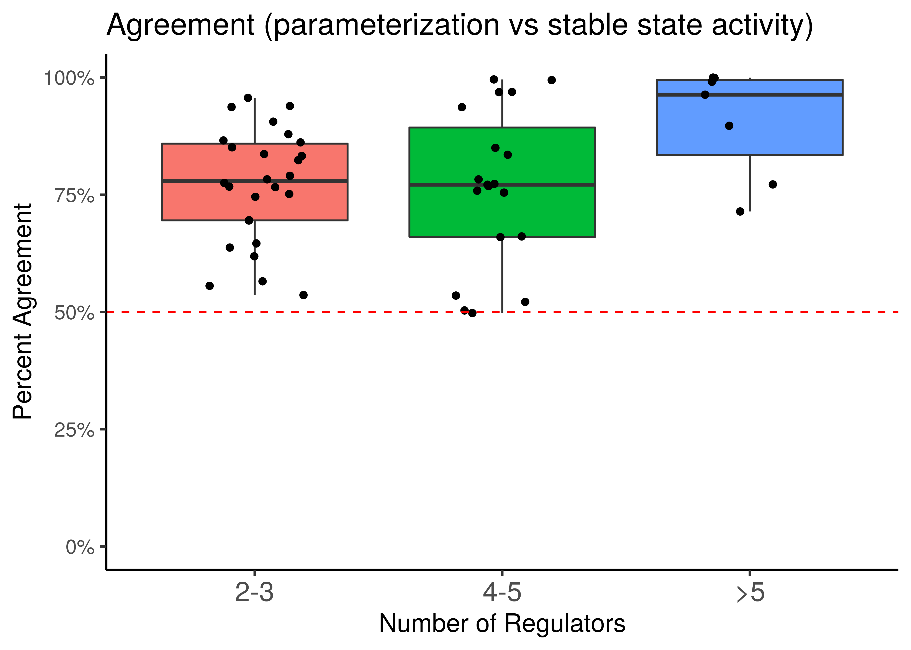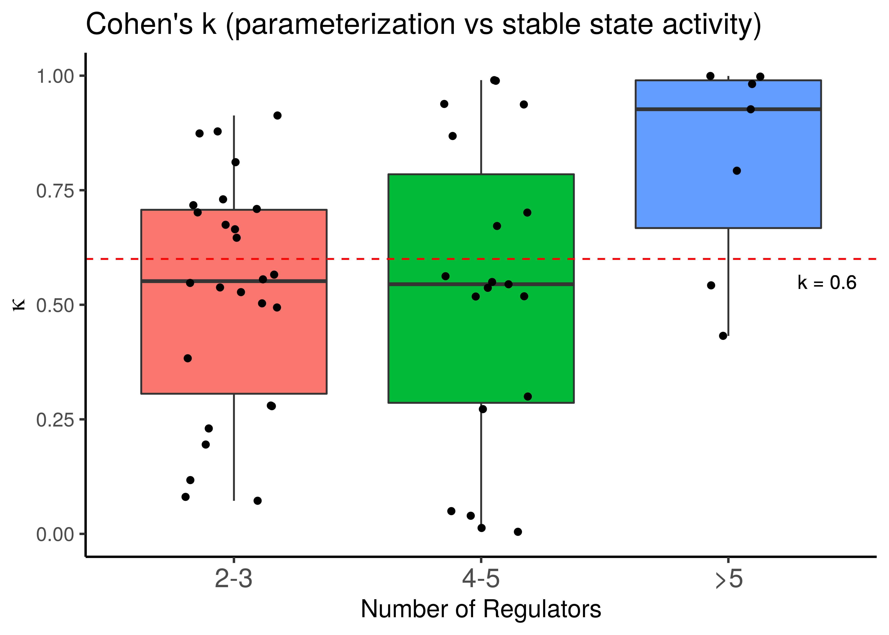
<p class="caption">(\#fig:ss-lo-prop-aggreement-cascade2-grouped)Parameterization and Stable State activity agreement. CASCADE 2.0 link operator nodes are grouped based on their respective number of regulators</p>
</div>

:::{.green-box}
The nodes with number of regulators $>5$ have always a percent agreement $\geq 75\%$ between stable state activity and link operator parameterization and $\kappa_{median}>0.6$.
The above results provide evidence that the statistics-based conclusion we reached in a [previous section](#stand-eq-bias) is correct, i.e. that the **standardized boolean formula is biased for larger number of regulators**.
:::

# Random scale-free Networks Analysis {-}

## Method {-}

:::{.green-box}

```r
knitr::include_graphics(path = "img/scale_free_methodology.png")
```

<div class="figure">

<p class="caption">(\#fig:unnamed-chunk-3)Methodology Overview</p>
</div>
:::

- We generate the scale-free topology `.sif` files with the script [random_topo_gen.R](https://github.com/bblodfon/brf-bias/blob/main/scripts/random_topo_gen.R) - implementation was based on the BoolNet R package [@Mussel2010].
The input degree distribution of the scale-free networks follows Riemann's Zeta function [@Aldana2003].
- We use the [abmlog](https://github.com/druglogics/abmlog/releases/tag/v1.6.0) software to produce every possible link operator parameterized boolean model out of every topology file created in the previous step.
The more link operator equations the network topology has (target nodes with both *activating* and *inhibiting* regulators) the more boolean models are generated (see script [run_abmlog_topology_files.sh](https://github.com/bblodfon/brf-bias/blob/main/scripts/run_abmlog_topology_files.sh)).
- We analyze the data from all the abmlog-produced models and **compare stable state and link operator assignment** and produce agreement statistics (see script [get_scale_free_model_stats.R](https://github.com/bblodfon/brf-bias/blob/main/scripts/get_scale_free_model_stats.R))

:::{.note}
Most of the scale-free networks studied in literature have $\gamma\in[2,2.5]$ - see **Fig. 5** in [@Aldana2003].
:::

## Topology Stats {-}

Some statistics on the scale-free network topologies produced:

```r
knitr::include_graphics(path = "img/lo_eq_density.png")
knitr::include_graphics(path = "img/max_reg_density.png")
```

<div class="figure">

<p class="caption">(\#fig:unnamed-chunk-4)Scale-free networks Topology statistics</p>
</div>

:::{.green-box}
- $\gamma=2$ provides networks with statistically **more link operator nodes (targeted by both positive and negative regulators)** and thus these topologies will produce more boolean models via `abmlog`, so **more stable state data** to compare with the respective parameterization.
- We also observe for both $\gamma$'s the presence of **link operator nodes with high numbers of regulators** which is exactly what we needed from the dataset to test if the standardized regulatory functions are biased or not.
- $\gamma=2$ also provides networks with statistically **higher in-degree for the largest hub-nodes** and thus present **better candidates** for testing the truth density bias of the standardized boolean regulatory functions, which manifests especially for nodes with high input-degree (e.g. $\ge 8$)
:::

## Boolean Model Stats {-}

Some statistics regarding the abmlog-produced boolean models and their respective stable states:

```r
knitr::include_graphics(path = "img/ss_dist.png")
knitr::include_graphics(path = "img/ss_dist_total_sum.png")
```


```r
knitr::include_graphics(path = "img/zero_ss_dist.png")
```

<div class="figure">

<p class="caption">(\#fig:unnamed-chunk-6)Stable state statistics</p>
</div>

:::{.green-box}
- **More stable state data** for $\gamma=2$, even though we had $\times10$ more scale-free networks produced with $\gamma=2.5$.
- $\approx 50\%$ of the scale-free topologies that pass through `abmlog` and produce all possible link operator parameterized boolean models, **do not have any model with a stable state**.
:::

## Parameterization vs Activity {-}


```r
sf_stats_g2_5 = readRDS(file = "data/sf_stats_gamma2.5.rds")
sf_stats_g2 = readRDS(file = "data/sf_stats_gamma2.rds")
```

We will **organize the link operator nodes on separate groups** based on the number of regulators they have and compare nodes coming from different-$\gamma$ scale-free topologies in separate sections/figures.

For the agreement statistics we will use the **percent agreement** and Cohen's $\kappa$ as before (see [note](#percent-agreement-note)).

### Results for networks with $\gamma = 2$ {-}


```r
sf_stats_g2 = 
  sf_stats_g2 %>% mutate(reg_group = factor(case_when(
  num_reg %in% 2:3 ~ "2-3", 
  num_reg %in% 4:6 ~ "4-6", 
  num_reg %in% 7:10 ~ "7-10", 
  num_reg %in% 11:14 ~ "11-14", 
  num_reg %in% 15:20 ~ "15-20",
  TRUE ~ ">20"), levels = c("2-3", "4-6", "7-10", "11-14", "15-20", ">20"))) 

sf_stats_g2 %>%
  ggplot(aes(x = reg_group, y = percent_agreement, fill = reg_group)) + 
  geom_boxplot(show.legend = FALSE) +
  scale_y_continuous(labels = scales::percent, limits = c(0,1)) +
  labs(title = latex2exp::TeX("Agreement (parameterization vs stable state activity) - $\\gamma$ = 2"), x = "Number of Regulators", y = "Percent Agreement") +
  geom_hline(yintercept = 0.5, linetype = 'dashed', color = "red") +
  theme_classic(base_size = 14) +
  theme(axis.text.x = element_text(size = 15))

sf_stats_g2 %>%
  ggplot(aes(x = reg_group, y = cohen_k, fill = reg_group)) + 
  geom_boxplot(show.legend = FALSE) +
  scale_y_continuous(limits = c(0,1)) +
  labs(title = latex2exp::TeX("Cohen's k (parameterization vs stable state activity) - $\\gamma$ = 2"), x = "Number of Regulators", y = latex2exp::TeX("$\\kappa$")) +
  geom_hline(yintercept = 0.6, linetype = 'dashed', color = "red") +
  geom_text(aes(x = 6, y = 0.55, label="k = 0.6")) + 
  theme_classic(base_size = 14) +
  theme(axis.text.x = element_text(size = 15))
```

<div class="figure">

<p class="caption">(\#fig:agree-stats-g2)Link operator Parameterization vs Stable State Activity for scale-free topologies with $\gamma$ = 2</p>
</div>

### Results for networks with $\gamma = 2.5$ {-}


```r
sf_stats_g2_5 = sf_stats_g2_5 %>% mutate(reg_group = factor(case_when(
  num_reg %in% 2:3 ~ "2-3", 
  num_reg %in% 4:6 ~ "4-6", 
  num_reg %in% 7:10 ~ "7-10", 
  num_reg %in% 11:14 ~ "11-14", 
  num_reg %in% 15:20 ~ "15-20",
  TRUE ~ ">20"), levels = c("2-3", "4-6", "7-10", "11-14", "15-20", ">20"))) 

sf_stats_g2_5 %>%
  ggplot(aes(x = reg_group, y = percent_agreement, fill = reg_group)) + 
  geom_boxplot(show.legend = FALSE) +
  scale_y_continuous(labels = scales::percent, limits = c(0,1)) +
  labs(title = latex2exp::TeX("Agreement (parameterization vs stable state activity) - $\\gamma$ = 2.5"), x = "Number of Regulators", y = "Percent Agreement") +
  geom_hline(yintercept = 0.5, linetype = 'dashed', color = "red") +
  theme_classic(base_size = 14) +
  theme(axis.text.x = element_text(size = 15), plot.title = element_text(size = 16))

sf_stats_g2_5 %>%
  ggplot(aes(x = reg_group, y = cohen_k, fill = reg_group)) + 
  geom_boxplot(show.legend = FALSE) +
  scale_y_continuous(limits = c(0,1)) +
  labs(title = latex2exp::TeX("Cohen's k (parameterization vs stable state activity) - $\\gamma$ = 2.5"), x = "Number of Regulators", y = latex2exp::TeX("$\\kappa$")) +
  geom_hline(yintercept = 0.6, linetype = 'dashed', color = "red") +
  geom_text(aes(x = 6, y = 0.55, label="k = 0.6")) + 
  theme_classic(base_size = 14) +
  theme(axis.text.x = element_text(size = 15), plot.title = element_text(size = 16))
```

<div class="figure">

<p class="caption">(\#fig:agree-stats-g2-5)Link operator Parameterization vs Stable State Activity for scale-free topologies with $\gamma$ = 2.5</p>
</div>

:::{.green-box}
Results for both $\gamma$'s show the same thing: **the higher the number of regulators, the more biased the boolean link operator function result is**.

Specifically, for both $\gamma$'s, we observe that for $n>7-10$ regulators, assigning a node the `AND-NOT` link operator in its corresponding equation, results in it having a stable state equal to $0$ and vice-versa for the `OR-NOT` case.
:::


# R session info {-}


```{.r .fold-show}
xfun::session_info()
```

```
R version 3.6.3 (2020-02-29)
Platform: x86_64-pc-linux-gnu (64-bit)
Running under: Ubuntu 20.04.1 LTS

Locale:
  LC_CTYPE=en_US.UTF-8       LC_NUMERIC=C              
  LC_TIME=en_US.UTF-8        LC_COLLATE=en_US.UTF-8    
  LC_MONETARY=en_US.UTF-8    LC_MESSAGES=en_US.UTF-8   
  LC_PAPER=en_US.UTF-8       LC_NAME=C                 
  LC_ADDRESS=C               LC_TELEPHONE=C            
  LC_MEASUREMENT=en_US.UTF-8 LC_IDENTIFICATION=C       

Package version:
  abind_1.4-5              assertthat_0.2.1         backports_1.1.10        
  base64enc_0.1.3          BH_1.72.0.3              bookdown_0.21           
  BoolNet_2.1.5            boot_1.3.25              broom_0.7.2             
  callr_3.5.1              car_3.0-10               carData_3.0-4           
  cellranger_1.1.0         cli_2.1.0                clipr_0.7.1             
  codetools_0.2-16         colorspace_1.4-1         compiler_3.6.3          
  conquer_1.0.2            corrplot_0.84            cowplot_1.1.0           
  cpp11_0.2.3              crayon_1.3.4             crosstalk_1.1.0.1       
  curl_4.3                 data.table_1.13.2        desc_1.2.0              
  digest_0.6.27            doParallel_1.0.16        dplyr_1.0.2             
  DT_0.16                  ellipsis_0.3.1           evaluate_0.14           
  fansi_0.4.1              farver_2.0.3             forcats_0.5.0           
  foreach_1.5.1            foreign_0.8-75           generics_0.0.2          
  ggplot2_3.3.2            ggpubr_0.4.0             ggrepel_0.8.2           
  ggsci_2.9                ggsignif_0.6.0           glue_1.4.2              
  graphics_3.6.3           grDevices_3.6.3          grid_3.6.3              
  gridExtra_2.3            gtable_0.3.0             gtools_3.8.2            
  haven_2.3.1              highr_0.8                hms_0.5.3               
  htmltools_0.5.0          htmlwidgets_1.5.2        igraph_1.2.6            
  isoband_0.2.2            iterators_1.0.13         jsonlite_1.7.1          
  knitr_1.30               labeling_0.4.2           later_1.1.0.1           
  latex2exp_0.4.0          lattice_0.20.41          lazyeval_0.2.2          
  lifecycle_0.2.0          lme4_1.1.25              magrittr_1.5            
  maptools_1.0.2           markdown_1.1             MASS_7.3.53             
  Matrix_1.2.18            MatrixModels_0.4.1       matrixStats_0.57.0      
  methods_3.6.3            mgcv_1.8.33              mime_0.9                
  minqa_1.2.4              munsell_0.5.0            nlme_3.1.149            
  nloptr_1.2.2.2           nnet_7.3.14              openxlsx_4.2.2          
  parallel_3.6.3           pbkrtest_0.4.8.6         pillar_1.4.6            
  pkgbuild_1.1.0           pkgconfig_2.0.3          pkgload_1.1.0           
  png_0.1-7                polynom_1.4.0            praise_1.0.0            
  prettyunits_1.1.1        processx_3.4.4           progress_1.2.2          
  promises_1.1.1           ps_1.4.0                 purrr_0.3.4             
  quantreg_5.74            R6_2.4.1                 RColorBrewer_1.1.2      
  Rcpp_1.0.5               RcppArmadillo_0.10.1.0.0 RcppEigen_0.3.3.7.0     
  readr_1.4.0              readxl_1.3.1             rematch_1.0.1           
  rio_0.5.16               rlang_0.4.8              rmarkdown_2.5           
  rprojroot_1.3.2          rstatix_0.6.0            rstudioapi_0.11         
  scales_1.1.1             sp_1.4.4                 SparseM_1.78            
  splines_3.6.3            statmod_1.4.35           stats_3.6.3             
  stringi_1.5.3            stringr_1.4.0            testthat_2.3.2          
  tibble_3.0.4             tidyr_1.1.2              tidyselect_1.1.0        
  tinytex_0.26             tools_3.6.3              usefun_0.4.8            
  utf8_1.1.4               utils_3.6.3              vctrs_0.3.4             
  viridisLite_0.3.0        withr_2.3.0              xfun_0.18               
  XML_3.99-0.3             yaml_2.2.1               zip_2.1.1               
```

# References {-}
